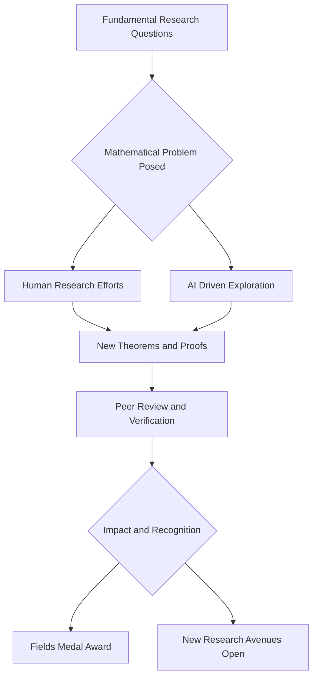

**Mathematics in Motion: Fields Medals Awarded and AI Breakthroughs Reshape the Landscape**

As of July 25, 2026, the world of mathematics is abuzz with groundbreaking announcements, signaling an era of rapid progress driven by both human ingenuity and the burgeoning power of artificial intelligence.

The most anticipated news comes from the International Mathematical Union, which on July 23, 2026, awarded the prestigious Fields Medals to four brilliant mathematicians. Notably, New York University's Hong Wang became only the third woman in the award's 90-year history to receive the honor. Wang was recognized for her major advances in harmonic analysis and geometric measure theory, including her work on the three-dimensional Kakeya conjecture, a problem that puzzled researchers for decades by asking how little space is needed to rotate a needle in every possible direction. Her co-recipients include Yu Deng of the University of Chicago, honored for connecting microscopic and macroscopic descriptions of gases; John Pardon of Stony Brook University, for solving significant problems in topology and geometry; and Jacob Tsimerman of the University of Toronto, for developing powerful new techniques in algebraic geometry. These awards, often dubbed the "Nobel Prize of mathematics," celebrate outstanding achievement and the promise of future discoveries by mathematicians under 40.

Beyond individual accolades, 2026 has also witnessed a profound shift with the increasing involvement of artificial intelligence in mathematical discovery. In May 2026, OpenAI's generative AI made headlines by autonomously resolving the 80-year-old Unit Distance Conjecture, a significant problem in discrete geometry. This breakthrough, which involved unexpected connections between discrete geometry and algebraic number theory, was subsequently simplified and formalized by human researchers. Just a week later, human mathematicians adapted the AI's core technique to solve another long-standing challenge, the sum-product conjecture. This rapid sequence of events suggests a new "golden age" where AI tools are not just assisting but actively contributing novel insights to solve problems that have stumped human minds for decades.

The combination of foundational human discoveries, recognized by awards like the Fields Medal, and the accelerating pace of AI-driven problem-solving paints a vibrant picture for the future of mathematics.

