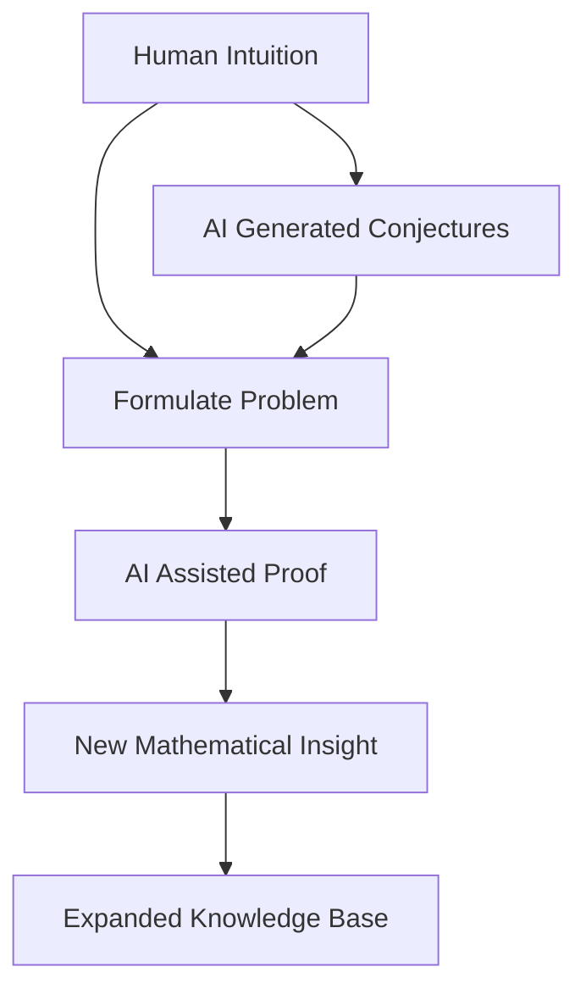

The world of mathematics is currently abuzz with a transformative shift, as Artificial Intelligence increasingly plays a pivotal role in accelerating discovery and problem-solving. As of July 2026, the impact of AI on mathematical research is not just theoretical but evident in tangible breakthroughs and a reshaping of research methodologies.

Just last week, on July 20, 2026, a significant milestone was reached when a generative AI system reportedly resolved the long-standing "Jacobian Conjecture," a famous open problem in algebraic geometry for a century. This came after a 23-year-old had previously leveraged ChatGPT to concisely solve Erdős Problem #1196 in just over 80 minutes. These achievements highlight a "golden age" where AI tools, such as AlphaProof, AlphaEvolve, and Gemini Deep Think, are not only assisting with theorem proving and formal proof verification but also generating conjectures and identifying complex patterns that were previously out of reach.

The ongoing International Congress of Mathematicians (ICM) in Philadelphia this July is dedicating significant attention to this "AI revolution," with panels and lectures exploring how AI and formalization will change mathematical research and education. While AI excels at computational tasks, pattern recognition, and rigorous proof verification, the creative, conceptual, and intuitive aspects of mathematics remain distinctly human. Mathematicians are adapting to this new landscape, learning to collaborate with AI systems to push the boundaries of mathematical knowledge further than either could alone. This partnership is fostering new results in diverse areas from knot theory to combinatorial design theory, and accelerating applied mathematical modeling across scientific fields.

However, this rapid advancement also brings discussions about the quality of AI-generated research, the strain on peer review systems, and the epistemological question of novel concept creation. The challenge now lies in harnessing AI as a powerful tool while maintaining the rigor, understanding, and human ingenuity that define mathematical progress.

