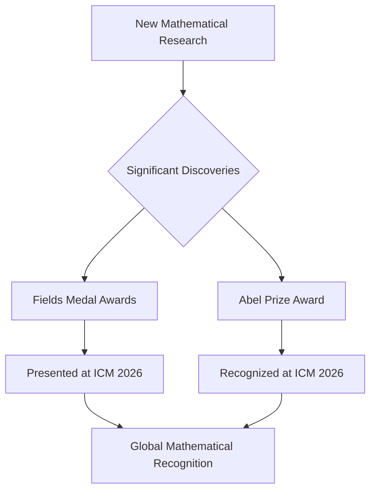

## Mathematics World Gathers for ICM 2026 as New Laureates Honored

The mathematical community is abuzz this week as the International Congress of Mathematicians (ICM) 2026 convenes in Philadelphia, USA, from July 23 to July 30, 2026. This quadrennial event serves as a pinnacle for global collaboration and the recognition of groundbreaking achievements in the field. Mathematicians from around the world have gathered to share research, discuss new theories, and celebrate the advancements shaping the future of mathematics.

A major highlight of the ICM 2026 is the presentation of the prestigious Fields Medals, often considered the "Nobel Prize for mathematicians" for those under 40. The International Mathematical Union (IMU) awards these medals to recognize outstanding mathematical achievement and the promise of future breakthroughs. This year's recipients include Yu Deng, John Pardon, Jacob Tsimerman, and Hong Wang, celebrated for their profound contributions across various mathematical disciplines.

Adding to the year's significant accolades, Professor Gerd Faltings of the Max Planck Institute for Mathematics in Bonn, Germany, was awarded the Abel Prize 2026 earlier this year. Announced in March 2026, Faltings received the honor for his powerful tools in arithmetic geometry and for resolving long-standing Diophantine conjectures, notably those of Mordell and Lang. His work represents a crucial fusion of number theory and abstract geometric forms, demonstrating the interconnected nature of mathematical inquiry. Both the Fields Medals and the Abel Prize underscore a vibrant period of discovery and intellectual growth in mathematics.

