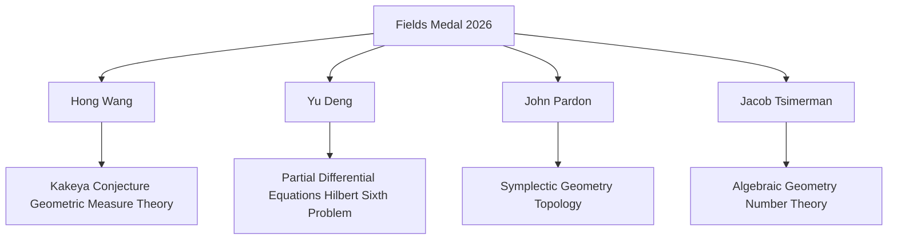

## Fields of Brilliance: Celebrating the 2026 Fields Medalists

Mathematics is abuzz this July as the International Mathematical Union (IMU) announced the recipients of the 2026 Fields Medals at the International Congress of Mathematicians (ICM) in Philadelphia. Widely considered the highest honor in mathematics for researchers under 40, this year's awards celebrate groundbreaking work across diverse fields and mark a historic moment.

The four exceptional mathematicians recognized for their outstanding discoveries are Hong Wang, Yu Deng, John Pardon, and Jacob Tsimerman.

**Hong Wang**, a professor at New York University, made history as only the third woman ever to receive the prestigious medal in its 90-year history. Her work in harmonic analysis and geometric measure theory, including her 2025 resolution of the long-standing Kakeya conjecture in three dimensions, was specifically highlighted.

**Yu Deng**, from the University of Chicago, was honored for his significant contributions to partial differential equations. His research includes the rigorous derivation of the Boltzmann equation from hard-sphere dynamics for rarefied gases, representing a leap forward in solving a major case of Hilbert's Sixth Problem.

**John Pardon** of Stony Brook University received the medal for his profound achievements in symplectic geometry and topology. His work includes new approaches to virtual fundamental cycles and the proof of the 20-year-old MNOP conjecture, relating to counting curves on specific geometric shapes.

Rounding out the quartet, **Jacob Tsimerman** from the University of Toronto was recognized for his powerful new techniques in algebraic geometry, which have advanced progress on long-standing mathematical puzzles, including results deeply related to the Hodge conjecture.

These awards not only highlight individual brilliance but also underscore the vibrant and expanding frontiers of mathematical inquiry.

