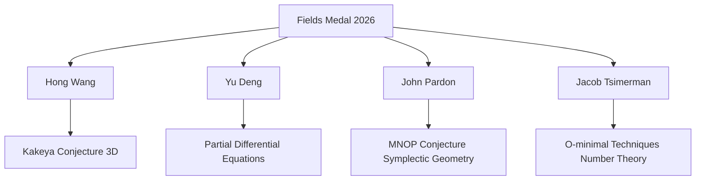

### Mathematics Celebrates New Heights at ICM 2026: Fields Medals Awarded, AI's Role Expands

As July 2026 draws to a close, the mathematics world is abuzz with momentous news from the International Congress of Mathematicians (ICM) in Philadelphia, which concludes today. The highlight of the congress was undoubtedly the awarding of the prestigious Fields Medals on July 23, recognizing outstanding mathematical achievement. This year's recipients are Hong Wang, Yu Deng, John Pardon, and Jacob Tsimerman, each honored for groundbreaking work that pushes the boundaries of mathematical understanding.

Hong Wang, a professor at New York University, made history as the third woman ever to receive a Fields Medal, lauded for her resolution of the three-dimensional Kakeya conjecture. This decades-old problem explores the minimum volume required to rotate a line segment (or "needle") to point in every direction in 3D space. Her proof, co-authored with Joshua Zahl, was a monumental 127-page work that opened new avenues in harmonic analysis and geometric measure theory.

Yu Deng, from the University of Chicago, was recognized for his profound contributions to partial differential equations, including rigorous derivations of fundamental equations from gas dynamics and wave kinetic equations. John Pardon of Stony Brook University received the medal for his work in symplectic geometry, notably proving the 20-year-old MNOP conjecture, which impacts areas from representation theory to quantum physics. Finally, Jacob Tsimerman of the University of Toronto was honored for his extensive use of o-minimal techniques in arithmetic and complex algebraic geometry, addressing complex problems in number theory.

Beyond these individual accolades, the ICM has also been a focal point for discussions on the rapidly evolving role of artificial intelligence in mathematics. Talks such as "Mathematics in the Age of AI" and "AI and Humanity's Long Conversation" underscored how generative AI, as demonstrated by OpenAI's recent resolution of the "unit distance conjecture" in May 2026, is ushering in a "golden age" of mathematical discovery. While humans continue to lead, AI is increasingly becoming a powerful companion in conjecturing patterns and assisting with complex proofs.

These developments, from fundamental breakthroughs by medal-winning mathematicians to the transformative impact of AI, paint a vibrant picture of mathematics as a dynamic and ever-expanding field.

