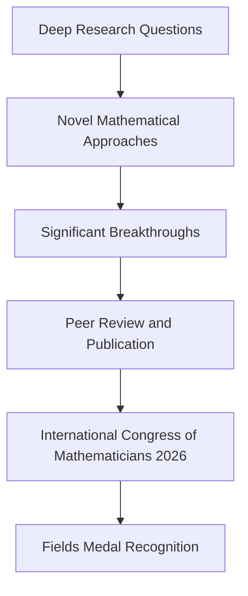

## Mathematics Shines Bright: Fields Medals Awarded at ICM 2026

The world of mathematics is abuzz with excitement following the recent International Congress of Mathematicians (ICM) 2026, held from July 23 to July 30 in Philadelphia. The quadrennial event, often dubbed the "Olympics of mathematics," culminated in the highly anticipated announcement of the 2026 Fields Medal recipients, celebrating groundbreaking achievements and promising future work in the field.

This year, four brilliant minds were honored with the prestigious Fields Medal, widely considered the highest recognition in mathematics: Yu Deng of the University of Chicago, John Pardon of Stony Brook University, Jacob Tsimerman of the University of Toronto, and Hong Wang of New York University and France's Institut des Hautes Études Scientifiques (IHES). The medal is awarded every four years to two to four mathematicians under the age of 40, acknowledging outstanding contributions and the potential for continued impact.

Among the celebrated achievements, Hong Wang was recognized for her work in harmonic analysis and geometric measure theory, notably for proving the three-dimensional version of the Kakeya problem, a century-old challenge asking how much space is needed to turn a needle to point in every direction. Jacob Tsimerman's contributions included significant results in model theory and algebraic geometry, with his work deeply related to the Hodge conjecture, one of the famous Millennium Prize Problems. Yu Deng received recognition for his rigorous derivation of the Boltzmann equation from hard-sphere dynamics, a monumental step in Hilbert's sixth problem. John Pardon was honored for his profound work in symplectic geometry, including proving the 20-year-old MNOP conjecture related to counting curves on specific shapes.

These distinguished mathematicians exemplify the depth, originality, and vitality of contemporary mathematics, pushing the boundaries of human understanding across diverse areas. The ICM 2026 served as a powerful reminder of the collaborative spirit and the continuous pursuit of knowledge that defines the mathematical community.

