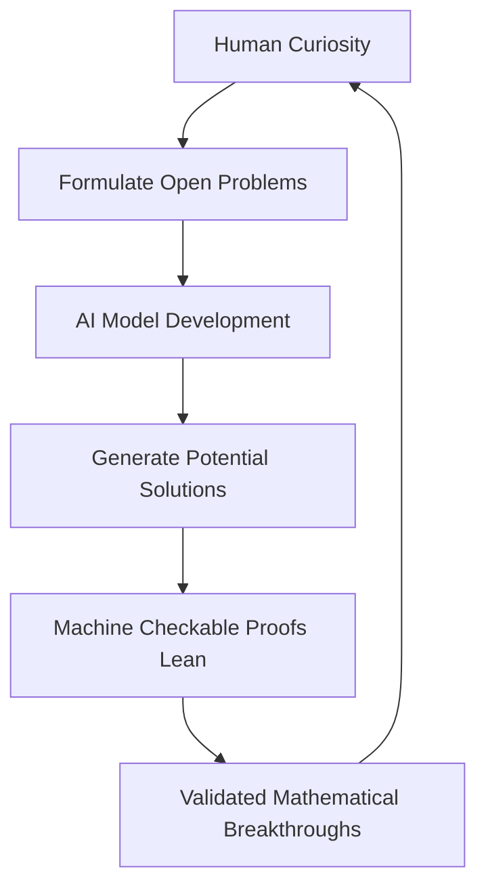

## Mathematics in the Age of AI: A Week of Monumental Breakthroughs

This week in mathematics has delivered a powerful reminder of the field's relentless progress, highlighted by both human brilliance and the burgeoning power of artificial intelligence. As of August 4, 2026, the mathematical community is abuzz with the recent announcement of the 2026 Fields Medalists and, even more strikingly, unprecedented breakthroughs achieved by AI.

Just days ago, on July 23, 2026, the mathematical world celebrated its highest honors with the awarding of the prestigious Fields Medals to Yu Deng, John Vincent Pardon, Jacob Tsimerman, and Hong Wang. These individuals were recognized for their transformative ideas, including Jacob Tsimerman's groundbreaking proof of the André–Oort conjecture in its full generality. Their achievements underscore the depth and creativity of human intellect at the frontier of mathematical research.

However, the most immediate and perhaps paradigm-shifting news arrived on August 1, 2026, when OpenAI announced that an internal version of its next major model, Astra, successfully solved ten long-standing open problems across various fields of mathematics and theoretical computer science. These problems, which had stumped human experts for decades, now have verifiable solutions, complete with machine-checkable proofs published on GitHub using the Lean theorem prover.

This follows an earlier significant AI milestone in May 2026, when another OpenAI AI reasoning model produced a counterexample to a conjectured bound in Paul Erdős's planar unit-distance problem, a question first posed in 1946. These developments signal a "phase transition" in AI's mathematical capabilities, prompting discussions about how AI might fundamentally change the landscape of mathematical research. The solutions provided by Astra include constructing non-sofic groups, refuting Connes' rigidity conjecture on von Neumann algebras, and establishing new upper bounds on sphere-packing density.

The implications are profound. With AI systems now capable of solving genuinely open problems and generating rigorous, machine-verifiable proofs, the cost of discovery is being drastically reduced. While human mathematicians continue to push conceptual boundaries, AI is emerging as an invaluable tool for accelerating discovery and tackling computationally intensive challenges. The future promises an exciting synergy between human ingenuity and artificial intelligence, expanding the frontiers of mathematics at an unprecedented pace.

