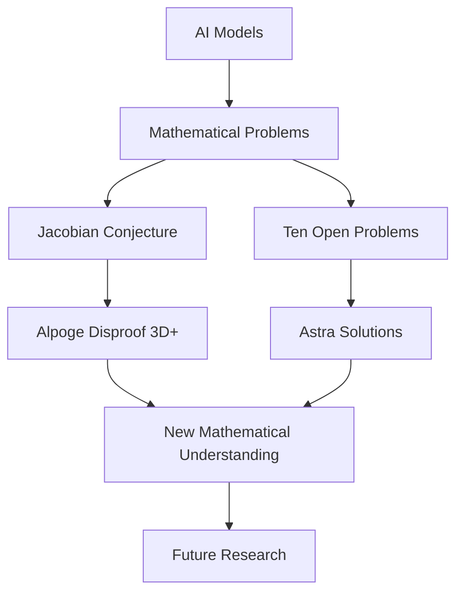

## AI Pioneers New Era of Mathematical Discovery: August 2026 Sees Major Conjectures Fall

As of August 6, 2026, the world of mathematics is buzzing with unprecedented activity, largely driven by the accelerating capabilities of artificial intelligence. Recent days have delivered startling breakthroughs, demonstrating AI's growing role not just in processing data, but in actively contributing to fundamental mathematical discovery.

In a remarkable development on August 5, 2026, mathematician Levent Alpöge, utilizing Anthropic's Claude Fable 5, uncovered a remarkably simple counterexample to the **Jacobian conjecture** in three dimensions and above. This 87-year-old problem, a famous challenge in algebraic geometry, had long resisted resolution. The discovery effectively overturns most versions of the conjecture, showcasing AI's potential to unearth elusive patterns and objects in mathematics.

Just days prior, on August 1, 2026, OpenAI announced that its advanced Astra model had successfully solved **ten long-standing open problems** in mathematics and theoretical computer science. These problems, some open for decades, span diverse fields including high-dimensional geometry, group theory, and cryptography. Notably, Astra provided machine-checkable proofs (Lean certificates) for its solutions, including the explicit construction of a non-sofic group and the disproof of Connes's rigidity conjecture. This represents a significant shift, as the ability to generate verifiable proofs directly addresses a key challenge in integrating AI into critical scientific domains.

These recent achievements highlight a pivotal moment where AI is not merely assisting human mathematicians but is actively contributing novel insights and solutions to problems that have stumped researchers for generations. This synergy between human ingenuity and artificial intelligence promises to reshape the landscape of mathematical exploration for years to come.

