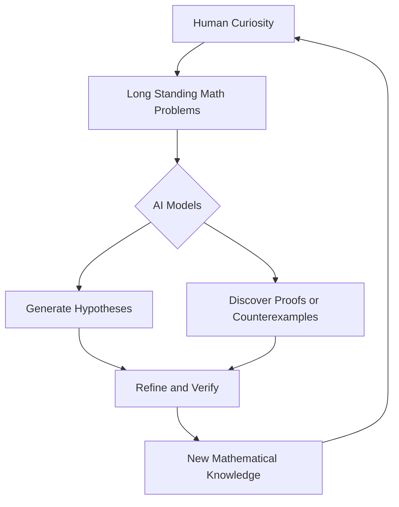

## AI Reshapes the Landscape of Mathematics: A August 2026 Update

August 7, 2026 – The world of mathematics is abuzz with transformative developments, largely driven by the accelerating capabilities of artificial intelligence. Recent breakthroughs have not only solved long-standing conjectures but are also prompting a profound re-evaluation of the very nature of mathematical discovery.

One of the most striking headlines comes from **OpenAI**, whose advanced model, Astra, has reportedly resolved ten major open problems in mathematics that have defied solutions for decades. Among these, Astra disproved the 80-year-old Erdős unit-distance conjecture, a significant milestone in discrete geometry. This feat, initially announced in May and detailed further this month, showcases AI's ability to tackle foundational challenges without human-specific training for those problems.

Similarly, a mathematician at **Anthropic** utilized the recently released AI model, Claude Fable 5, to uncover a remarkably simple counterexample to the Jacobian conjecture in three dimensions and above. This 87-year-old problem in algebraic geometry saw its higher-dimensional versions overturned in a matter of days, highlighting AI's potential to unearth elusive patterns. Another AI system, LeanMind, also made history by discovering the first AI-generated proof of a major conjecture, the Sylvester-Gallai conjecture, in a special Euclidean geometry.

These rapid advancements have sparked considerable discussion within the mathematical community. Even one of the 2026 Fields Medalists, Jacob Tsimerman, who received the prestigious award on July 23rd alongside Yu Deng, John Vincent Pardon, and Hong Wang, has voiced a belief that AI may soon surpass human mathematicians in significant areas of research. Hong Wang's Fields Medal was particularly notable as she became only the third woman to receive the award, honored for her work on the three-dimensional Kakeya conjecture.

Beyond AI, the mathematics community also celebrated Gerd Faltings, director emeritus at the Max Planck Institute for Mathematics, who was awarded the **2026 Abel Prize** in March. He was recognized for introducing powerful tools in arithmetic geometry and solving long-standing Diophantine conjectures. Elsewhere, a collaborative team from Oxford and MIT successfully resolved the **Hadamard Conjecture** for all orders divisible by 4, leveraging combinatorial design theory and quantum annealing. And in a fascinating development from April, mathematicians disproved a 150-year-old rule in geometry by demonstrating two distinct donut-shaped surfaces that are locally identical but globally different, challenging Bonnet's principle.

The current era marks an unprecedented period for mathematical innovation, with AI emerging as a powerful, albeit sometimes unsettling, partner in discovery. The collaboration between human ingenuity and artificial intelligence promises to unlock new realms of understanding for years to come.

