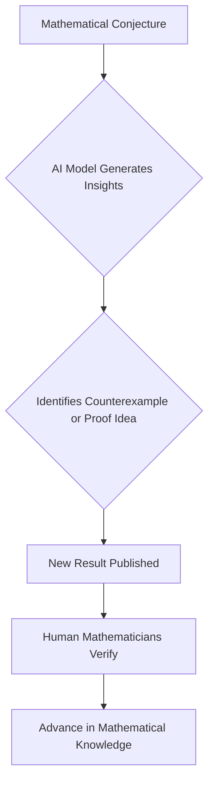

## AI Pioneers New Era of Mathematical Discovery in August 2026

The world of mathematics is buzzing with excitement this August as artificial intelligence models demonstrate unprecedented capabilities in tackling long-standing open problems. These recent breakthroughs signal a transformative shift, positioning AI not just as a tool, but as an active collaborator in pushing the frontiers of mathematical understanding.

Just days ago, on August 5, 2026, a major development in algebraic geometry sent ripples through the scientific community: Anthropic's AI model, Claude Fable 5, successfully uncovered a remarkably simple counterexample to the Jacobian conjecture in three dimensions and beyond. This problem, which has challenged mathematicians for 87 years, saw its higher-dimensional versions disproven by the AI's innovative insight, although the original two-dimensional case remains unsolved. This singular discovery highlights AI's growing capacity to identify elegant solutions that have eluded human experts for decades.

This revelation closely followed another significant announcement from OpenAI on August 1, 2026. Their next-generation AI model, Astra, achieved a remarkable feat by solving ten previously open problems across various domains of mathematics and theoretical computer science. Among these complex solutions were a construction proving the existence of non-sofic groups and new upper bounds on sphere-packing density. What's particularly noteworthy is that these solutions were accompanied by machine-checkable Lean proofs, providing verifiable validation for these AI-driven milestones.

These developments underscore a new paradigm in mathematical research, where AI systems are becoming integral to the process of discovery. The symbiotic relationship between human ingenuity and artificial intelligence is poised to accelerate the pace of mathematical breakthroughs, opening pathways to understanding previously inaccessible problems.

