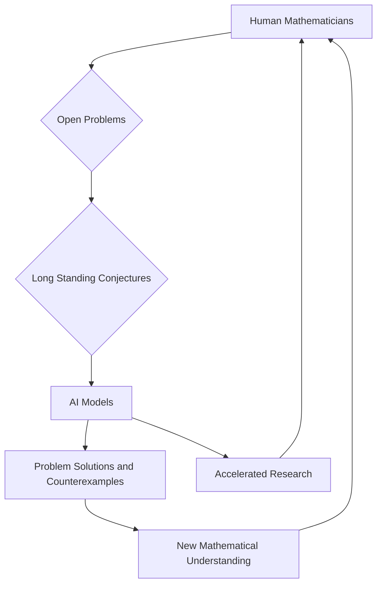

## Mathematics in the Midst of a Revolution: AI-Powered Discoveries Reshape the Landscape

**August 11, 2026** – The world of mathematics is buzzing with unprecedented activity, as a surge of breakthroughs, many powered by advanced Artificial Intelligence, transforms our understanding of age-old problems. As of August 2026, the collaboration—and sometimes competition—between human ingenuity and machine intelligence is ushering in a new era of discovery.

The most electrifying news comes from the realm of AI. Just days ago, on August 1st, OpenAI's internal "Astra" model reportedly delivered solutions to ten open problems spanning mathematics, quantum complexity, and theoretical computer science. These included disproving long-standing conjectures by mathematical giants like Erdős and Connes, with three problems from Erdős's famous list being resolved outright. This follows a significant announcement in May 2026, where an OpenAI model disproved the Erdős unit distance conjecture, a problem considered "arguably the best known" in discrete geometry.

Further demonstrating AI's rapidly evolving capabilities, on August 5th, Anthropic's Claude Fable 5 found a remarkably simple counterexample to the Jacobian conjecture, specifically for three dimensions and above. This 87-year-old problem had resisted mathematicians for decades, highlighting AI's ability to uncover elusive patterns and objects. Since late 2025, AI has also been credited with solving several other open problems posed by Paul Erdős, showcasing a dramatic acceleration in tackling previously intractable challenges.

While AI garners headlines, human mathematicians continue to push the boundaries with profound results. The 2026 Fields Medal, one of mathematics' highest honors, was awarded to Jacob Tsimerman in July for his groundbreaking proof of the André-Oort conjecture. This monumental achievement further solidifies significant progress in number theory and algebraic geometry.

Looking back to late 2025, the mathematical community celebrated the resolution of the three-dimensional Kakeya conjecture by Hong Wang and Joshua Zahl—a proof heralded as a "once-in-a-century" event that opened new avenues in analysis and geometric measure theory. Also, a major case of Hilbert's ambitious sixth problem saw significant progress, as researchers moved closer to rigorously deriving fluid dynamics from the motion of individual molecules. Another notable achievement was the proof of the geometric Langlands conjecture over characteristic zero fields by a team of nine researchers, a development some consider a potential "grand unified theory of mathematics."

The current landscape suggests a dynamic interplay where AI acts as a powerful assistant, proving and verifying complex theorems, while human mathematicians continue to provide the intuition, creativity, and high-level problem formulation that steers the direction of research. This synergy promises an exciting future for mathematics, expanding its frontiers at an unprecedented speed.

