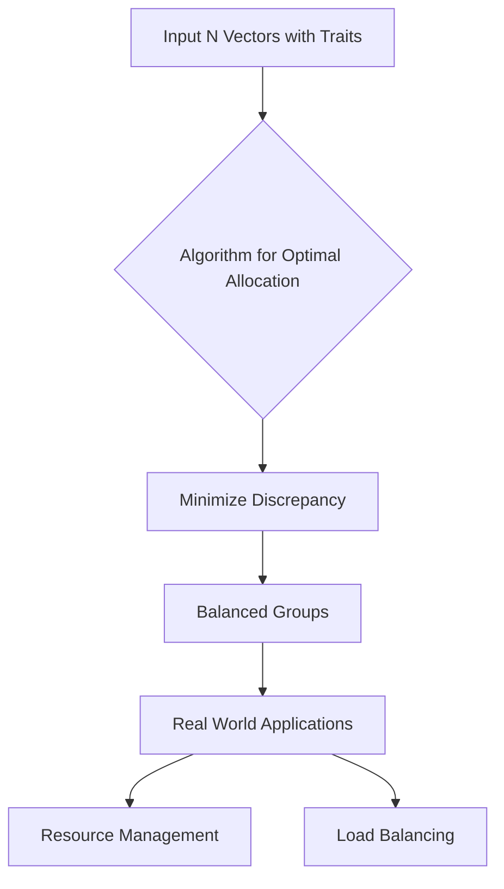

## Breakthrough in Discrepancy Theory Reshapes Fair Allocation

**August 21, 2026** – Today marks a significant milestone in mathematics and theoretical computer science, with a "huge breakthrough" announced in the long-standing Komlós problem, a core challenge in discrepancy theory. For the first time in 30 years, computer scientists have unveiled a more efficient method for evenly allocating objects between groups, a problem with wide-ranging practical implications.

The Komlós problem, first posed by János Komlós in 1981, deals with minimizing "discrepancy" when assigning items with various traits to different bins. Imagine trying to split a group of people, each with unique skills, into two teams as evenly matched as possible. Doing this perfectly becomes incredibly difficult as the number of people and traits increases. The challenge lies in finding an algorithm that guarantees a small imbalance, even in complex scenarios.

Researchers have now developed an algorithm that guarantees, for *N* vectors, the discrepancy can be at most log(N)¼. This is a dramatic improvement over previous bounds, which had remained stagnant for decades, leading many mathematicians to believe the earlier bound was optimal. The new result has been described as "astonishing" by experts and represents a major step forward in this "holy-grail problem" of discrepancy theory. This breakthrough promises to impact areas from resource allocation to load balancing in computer systems and experimental design.

In other recent news, July 23, 2026, saw the announcement of the prestigious Fields Medals, awarded to four pioneering young researchers. Among them, Hong Wang was recognized for her work on the Kakeya conjecture, and Yu Deng for connecting microscopic and macroscopic descriptions of gases, including deriving the Boltzmann equation. These advancements highlight the vibrant and continually evolving landscape of mathematical discovery.