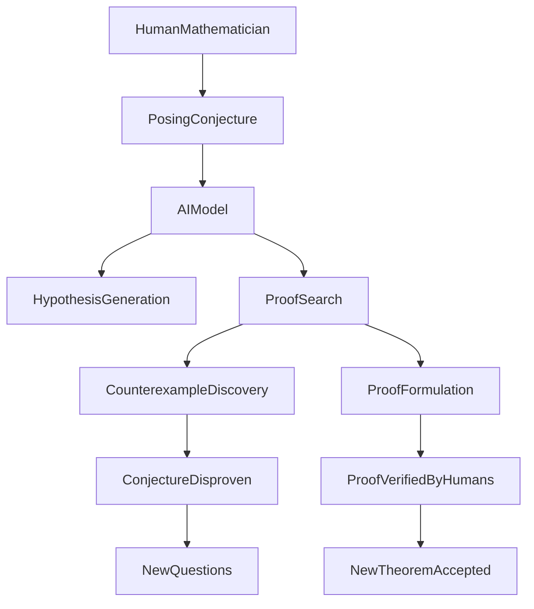

## Mathematics in the Machine Age: AI Reshapes Discovery and Proof

As of August 22, 2026, the world of mathematics is experiencing a profound shift, largely driven by the accelerating capabilities of artificial intelligence. What was once considered a purely human domain of intuition and rigorous logic is now seeing AI emerge not just as a computational aid, but as an active participant in discovery and proof.

One of the most striking recent developments occurred in July 2026, when an AI model, Claude Fable 5, played a significant role in disproving the long-standing Jacobian conjecture, an idea that had puzzled mathematicians for decades. This follows another notable achievement in June 2026, where an AI model from OpenAI disproved a conjecture by the renowned mathematician Paul Erdős regarding the unit distance problem, using tools from seemingly unrelated fields like algebra and number theory. These breakthroughs demonstrate AI's capacity to navigate complex mathematical landscapes and uncover solutions previously elusive to human minds.

Further underscoring this trend, China's RedNote announced in August 2026 that its dots-note-3.0 model achieved a perfect score of 42/42 on the International Mathematical Olympiad (IMO), a competition notorious for requiring complete and rigorously reviewed mathematical proofs. This milestone highlights the growing ability of AI systems to not only generate hypotheses but also to construct verifiable formal proofs.

The rapid integration of AI into mathematical research has also sparked important discussions within the community. In June 2026, concerns about AI-generated mathematical results causing confusion led to the "Leiden Declaration," signed by over 3,000 mathematicians, urging responsible use and proper verification and citation of AI tools. This reflects the ongoing dialogue about ensuring the integrity and transparency of mathematical knowledge in an increasingly AI-assisted era.

These recent events underscore that the future of mathematics will likely involve a dynamic collaboration between human intellect and advanced artificial intelligence, opening up new avenues for exploration and accelerating the pace of mathematical understanding.

