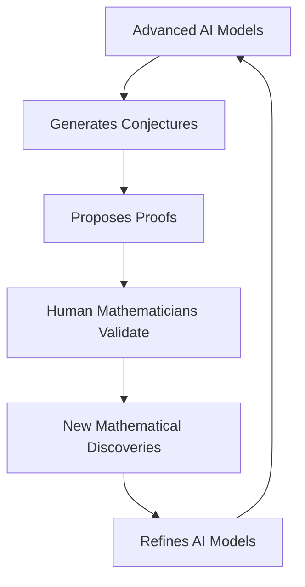

## The Algorithmic Muse: AI Reshapes the Landscape of Mathematics in 2026

August 24, 2026 – The world of mathematics is buzzing with unprecedented activity, largely fueled by a rapid series of breakthroughs in artificial intelligence that are fundamentally changing how mathematical research is conducted. This year marks a pivotal moment, as AI models move from assisting with calculations to actively contributing to core mathematical discovery.

Just recently, in February 2026, Google DeepMind unveiled Aletheia, an AI research agent capable of autonomously solving unpublished PhD-level mathematics problems. In the rigorous FirstProof Challenge, Aletheia delivered six correct proofs in less than a week, a feat many researchers once believed was years away for AI. This achievement signals AI's entry into genuine mathematical research, beyond mere benchmark tasks.

The impact has been swift and broad. OpenAI's internal AI model made waves in May 2026 by finding a counterexample to the "unit distance" problem, a longstanding conjecture by the prolific mathematician Paul Erdős. This was hailed as the first historically significant proof generated by an AI model. Further cementing this trend, in August 2026, OpenAI announced that another unreleased model, Astra, achieved ten additional mathematical advances, including solutions to three more Erdős problems. These developments are "changing dramatically the way mathematical research is being done".

Even the venerable Riemann Hypothesis, one of mathematics' most famous unsolved problems, has seen AI-driven progress. An unreleased research version of Anthropic's Claude model recently improved a long-standing lower bound for the fraction of zeros of the Riemann zeta function satisfying the hypothesis, increasing it from 41.6% to 67.2%. While not a full solution, this represents a significant stride on a related problem, with Claude producing a formally verifiable proof.

The adoption of AI tools is no longer a niche phenomenon. Approximately 1.3 million people now use ChatGPT weekly for advanced science and mathematics, a dramatic shift from occasional use to a regular part of mathematical research, with a growing number of academic papers acknowledging AI contributions.

While AI pushes the boundaries, traditional areas of mathematics continue to thrive. Conferences this year, such as the "Advances in Geometric and Quantum Topology" in Philadelphia in July, and workshops on "Stratified Topological Spaces" in Kiel, Germany, in August-September, highlight ongoing, cutting-edge research in topology, geometry, and their applications. The synergy between advanced computational methods and foundational mathematical inquiry promises a future where human intuition and artificial intelligence collaborate to unlock deeper mysteries.

The current era, characterized by rapid AI integration, marks a transformative period for mathematical discovery, setting the stage for unprecedented acceleration in understanding.

