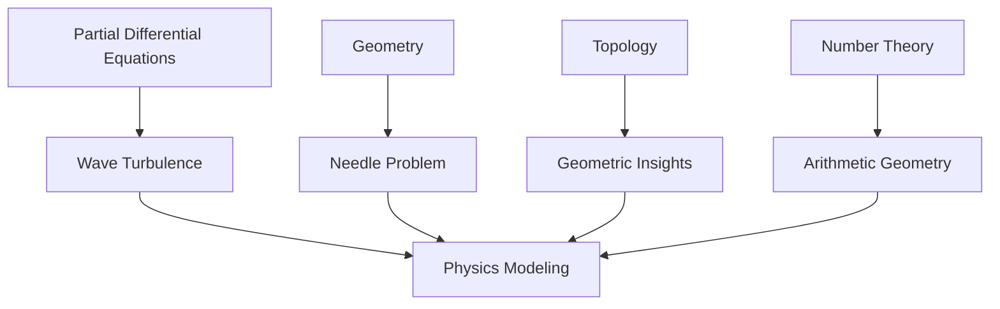

The mathematical world is abuzz following the recent announcements at the International Congress of Mathematicians (ICM) 2026, held from July 23-30 in Philadelphia. The highlight, as always, was the awarding of the prestigious Fields Medals, often considered the "Nobel Prize of mathematics." On July 23, the International Mathematical Union (IMU) recognized four brilliant mathematicians under the age of 40 for their profound contributions to the field.

The 2026 Fields Medals were awarded to:

*   **Dr. Yu Deng** of the University of Chicago, honored for his groundbreaking work in partial differential equations and wave turbulence. His research significantly connected microscopic and macroscopic descriptions of gases, providing a solution to a part of David Hilbert's ambitious sixth problem.
*   **Professor Hong Wang** from New York University, who became the third woman ever to win the Fields Medal in its 90-year history. Her work tackled a decades-old geometry problem concerning how needles move in 3D spaces.
*   **Dr. John Pardon** of Stony Brook University, recognized for solving major problems in topology and geometry.
*   **Professor Jacob Tsimerman**, whose significant contributions have further enriched the landscape of modern mathematics.

These awards underscore the dynamic and interconnected nature of contemporary mathematical research, pushing the boundaries of what's understood and opening new avenues for future discovery. The work of these medalists exemplifies how diverse areas of mathematics continually inform and enrich one another.

