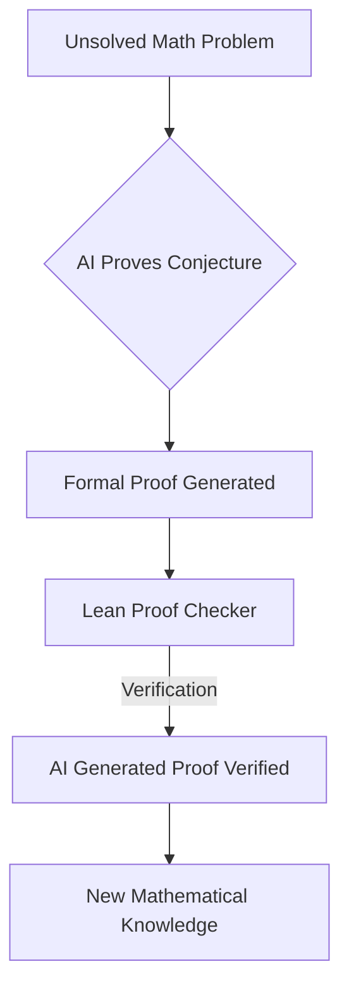

Mathematics in 2026: A Year of AI Breakthroughs and Celebrated Minds

As of August 26, 2026, the world of mathematics is buzzing with remarkable developments, highlighting both groundbreaking advancements in artificial intelligence and the continued brilliance of human ingenuity. This year has firmly established AI as a powerful force in mathematical discovery, while also celebrating the exceptional contributions of leading mathematicians.

The most prominent "live news" in mathematics comes from the significant leaps made by artificial intelligence. In a landmark achievement in May 2026, OpenAI's generative AI successfully resolved the 80-year-old **unit distance conjecture** in discrete geometry. This was not merely an application of existing knowledge, but a genuine counterexample that had eluded human mathematicians for decades. This breakthrough underscores AI's growing capacity for autonomous research in pure mathematics.

Further solidifying AI's role, Google DeepMind's systems, in the spring of 2026, delivered verified proofs for nine open problems from Paul Erdős's famous list, along with 44 other open conjectures. Crucially, these proofs were generated in a formal language called Lean and meticulously checked line-by-line by a computer, ensuring their rigor. This capability has led experts like Terence Tao to acknowledge that machines can now perform aspects of mathematics previously exclusive to humans. The US National Science Foundation even launched the Institute for Computer-Aided Reasoning in Mathematics (ICARM) in late 2025, signaling a rapid adaptation to these AI-driven tools. Another significant AI-discovered proof in 2026 was of the **Sylvester-Gallai conjecture** in Euclidean geometry, achieved by LeanMind without substantial human guidance, published in the Annals of Mathematics.

Beyond AI, the year also celebrated human excellence. The prestigious **Fields Medals**, often dubbed the "Nobel Prize of mathematics," were awarded on July 23, 2026. The four recipients, all under the age of 40, are Yu Deng of the University of Chicago, John Pardon of Stony Brook University, Jacob Tsimerman of the University of Toronto, and Hong Wang of New York University and IHES. These mathematicians were honored for their outstanding contributions across diverse fields, from partial differential equations and symplectic geometry to arithmetic algebraic geometry and harmonic analysis.

Other notable human-led advances in the past year include the resolution of the **Hadamard Conjecture for all orders greater than 4** in 2026 by a team from Oxford and MIT, and the challenging of a 150-year-old rule in geometry in April 2026, when mathematicians found two distinct doughnut-shaped surfaces that are locally identical but globally different.

The mathematical landscape is rapidly evolving, with AI not replacing but augmenting and redefining the frontiers of discovery.

