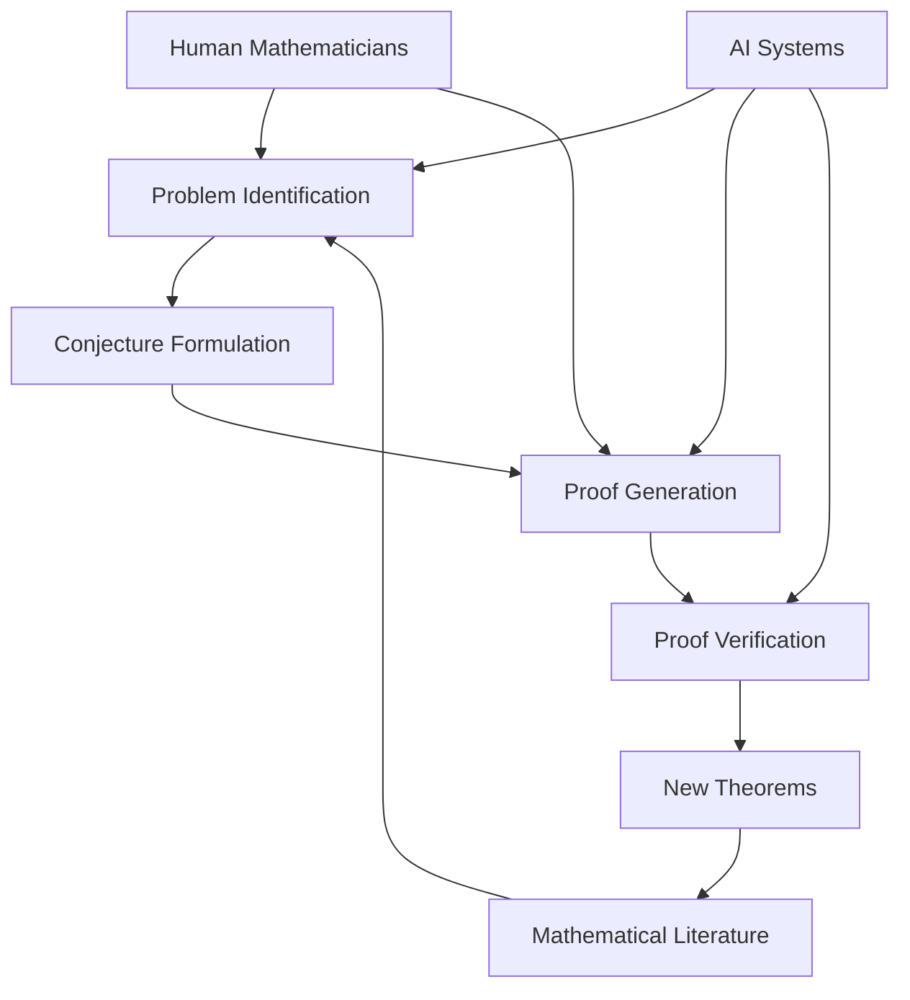

### Mathematics in 2026: The AI Era and Enduring Human Insight

August 28, 2026 finds the world of mathematics buzzing with transformative developments, primarily driven by the escalating role of artificial intelligence in pushing the boundaries of discovery and proof.

This year, AI systems have achieved historic milestones, including the first AI-discovered proof of a major conjecture, specifically the Sylvester-Gallai conjecture in a special Euclidean geometry. OpenAI's Astra model further showcased AI's capability by solving a key problem in group theory concerning the existence of non-sofic groups. Additionally, AI has assisted in the discovery of an elliptic curve with a rank of 30, a finding that challenges existing heuristics in number theory and suggests the possibility of unbounded ranks. These unprecedented capabilities have led many to consider whether we are entering a "golden age of mathematics".

Amidst these technological leaps, human ingenuity continues to be celebrated and recognized. The prestigious Fields Medals for 2026 were awarded in July to Yu Deng, John Pardon, Jacob Tsimerman, and Hong Wang for their outstanding mathematical achievements. Earlier in March, Gerd Faltings received the 2026 Abel Prize for his powerful tools in arithmetic geometry and his resolution of long-standing Diophantine conjectures of Mordell and Lang.

The dialogue surrounding AI's role—from a powerful assistant to a potential disrupter—is vigorous within the mathematical community. As mathematics evolves, it increasingly embraces both advanced computational power and the irreplaceable spark of human insight, charting a dynamic path forward for the discipline.

