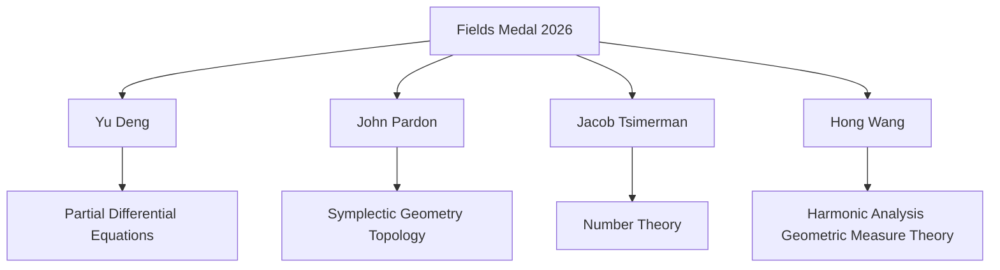

## Fields Medals 2026: Celebrating New Horizons in Mathematics

August 29, 2026 — The world of mathematics is abuzz with the recent announcement of the 2026 Fields Medals, often regarded as the Nobel Prize of mathematics. Awarded every four years to mathematicians under the age of 40, these prestigious medals recognize outstanding achievements and the promise of future breakthroughs. The recipients were honored during the International Congress of Mathematicians (ICM) held in Philadelphia on July 23, 2026, celebrating groundbreaking contributions across diverse fields.

This year's laureates represent a vibrant global community pushing the boundaries of mathematical thought. Yu Deng of the University of Chicago, a Chinese mathematician, was recognized for his profound work in partial differential equations. American mathematician John Pardon from Stony Brook University received the medal for his significant achievements in symplectic geometry and contributions to other areas of geometry and topology. Canadian mathematician Jacob Tsimerman of the University of Toronto was honored for his impactful research in number theory. Completing the quartet is Hong Wang, a Chinese mathematician affiliated with New York University and France's Institut des Hautes Études Scientifiques (IHES), whose medal acknowledges her pioneering work in harmonic analysis and geometric measure theory. Notably, Wang is the third woman in history to receive a Fields Medal.

Their innovative research highlights the interconnected and ever-evolving nature of modern mathematics, promising exciting new directions for future inquiry and application.

