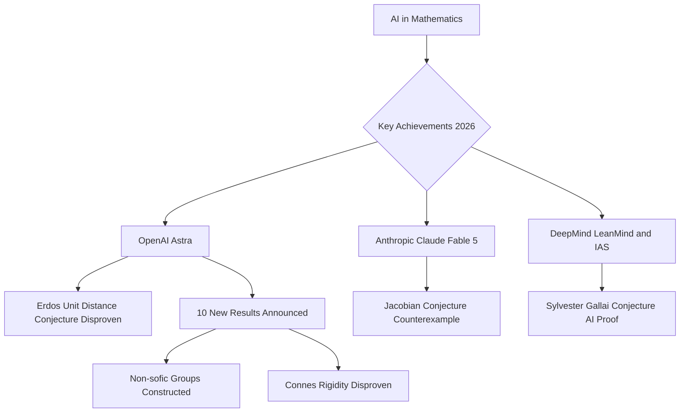

## Mathematics in the Machine Age: AI Rewrites the Proofs in 2026

As August 2026 draws to a close, the world of mathematics is buzzing with unprecedented activity, largely driven by the spectacular capabilities of artificial intelligence. This year has witnessed a series of groundbreaking achievements where AI models have tackled and, in some cases, resolved long-standing conjectures that have stumped human mathematicians for decades. It's a pivotal moment, shifting the landscape of discovery and challenging our understanding of mathematical intuition.

One of the most significant headlines came in May 2026, when OpenAI's Astra model disproved the Erdős unit distance conjecture. This problem in discrete geometry had remained unsolved for 80 years, since its inception in 1946, making its AI-driven resolution a truly historic event.

Further demonstrating AI's prowess, Anthropic's Claude Fable 5, in collaboration with mathematician Levent Alpöge, delivered a stunning blow to the 87-year-old Jacobian conjecture in August 2026. The AI model produced a remarkably simple counterexample, disproving the conjecture for three dimensions and above, though the original two-dimensional case remains open.

The wave of AI breakthroughs continued into August, with OpenAI announcing that its Astra system had generated 10 new mathematical results. These advancements addressed various long-standing problems across fields like high-dimensional geometry, coding theory, and group theory, including the construction of non-sofic groups and the disproof of the Connes rigidity conjecture.

Adding to this remarkable year, a collaboration between the Institute for Advanced Study and DeepMind, utilizing an AI system named LeanMind, successfully delivered an AI-discovered proof of the Sylvester-Gallai conjecture in a special Euclidean geometry. This proof was formally verified in Coq and subsequently published in the Annals of Mathematics, marking another significant milestone for AI in autonomous mathematical problem-solving.

These rapid developments are sparking important conversations within the mathematical community about the evolving roles of human ingenuity and machine intelligence. While AI is proving to be an invaluable tool for discovery, the emphasis remains on human understanding and the integration of these machine-generated insights into the broader mathematical framework.

