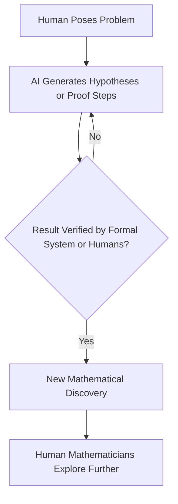

## AI Pioneers New Paths in Mathematical Discovery

**September 1, 2026** – The world of mathematics is abuzz with transformative developments this year, particularly with the rapidly accelerating role of artificial intelligence in groundbreaking discoveries. Far from being just a tool for computation, AI is increasingly demonstrating its capacity for genuine mathematical insight, tackling problems that have long stymied human minds.

One of the most notable headlines came in May 2026, when an AI model from OpenAI made history by disproving the 80-year-old Erdős unit-distance conjecture in discrete geometry. This achievement, along with an AI-discovered proof of the Sylvester-Gallai conjecture in a special Euclidean geometry earlier this year, highlights AI's ability to generate novel proofs and counterexamples that inspire new mathematical frameworks. OpenAI further published ten new mathematical results generated by its latest AI model in August.

These advancements are prompting mathematicians to consider a new era of human-AI collaboration in research. While the AI models are generating stunning results, human mathematicians remain crucial for initial problem formulation, deeper theoretical understanding, and guiding further exploration.

The process of discovery is evolving:

This symbiotic relationship promises to accelerate the pace of mathematical progress, opening up avenues previously unimaginable. As AI tools become more sophisticated, their impact on uncovering the hidden structures and truths of the mathematical universe is only just beginning.