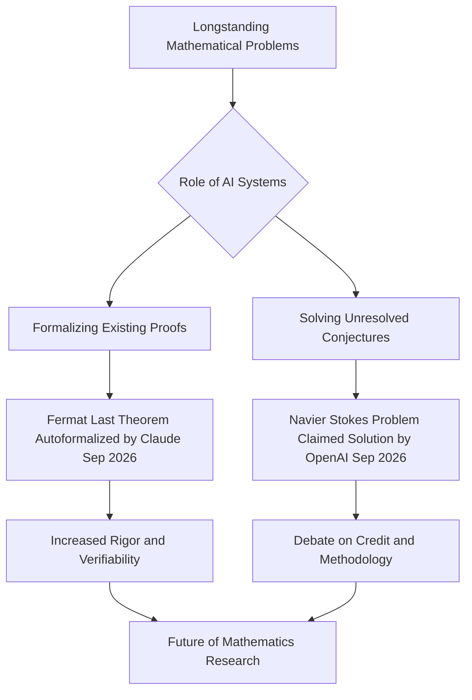

## AI Transforms Mathematics: Navier-Stokes Breakthrough and Formal Proofs Dominate September News

**September 10, 2026** – The world of mathematics is buzzing with groundbreaking advancements this September, primarily driven by the accelerating capabilities of artificial intelligence. Major news includes an AI system's claimed resolution of a Millennium Prize Problem and the complete autoformalization of a historic theorem.

On September 8, OpenAI announced that its advanced AI system had found a solution to the Navier-Stokes existence and smoothness problem, one of the seven notoriously difficult Millennium Prize Problems. The company stated that approximately 10,000 AI agents worked autonomously for 88 hours to achieve this breakthrough, a feat that has eluded human mathematicians for nearly two centuries. This claimed solution, if verified, carries a $1 million prize from the Clay Mathematics Institute and signifies a monumental leap in AI's problem-solving capacity.

However, the announcement has quickly become mired in controversy. Mathematician Tristan Buckmaster of New York University and Levent Alpöge, a researcher at Anthropic, stated they had also made significant progress on the Navier-Stokes problem and had used OpenAI's Codex model in their work. This has led to concerns about potential data influence, though OpenAI has denied that recent user inputs affected their system's development.

Meanwhile, just days earlier on September 4, Anthropic revealed that its AI model, Claude, had achieved the first complete computer-checked proof of Fermat's Last Theorem. Working largely autonomously over 11 days, Claude generated 13 million lines of code in the Lean programming language and proved 29,500 intermediate theorems to formalize the complex proof originally provided by Sir Andrew Wiles. This achievement marks a significant step towards autoformalization, promising to reduce the burden of proof verification and increase trust in the mathematical body of knowledge.

These events underscore a pivotal moment for mathematics, as AI tools are increasingly demonstrating the ability to not only assist in research but also to independently tackle and solve problems that have long challenged human intellect. The ongoing discussions about credit, methodology, and the future role of AI in mathematical discovery are set to redefine the landscape of the discipline for decades to come.

