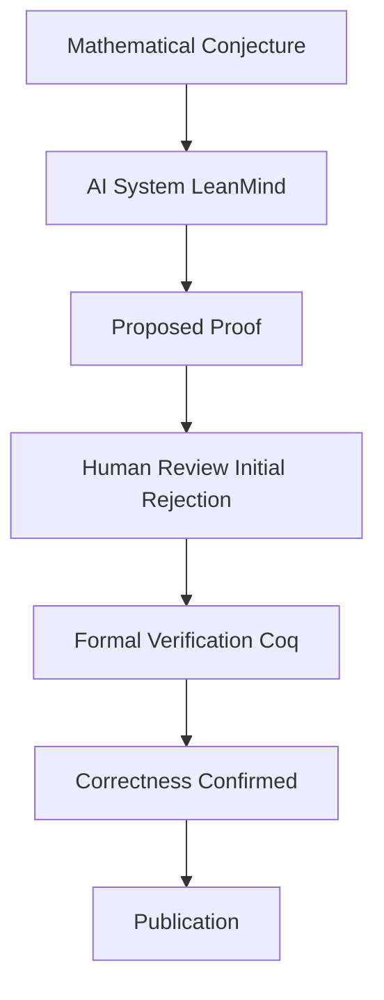

## Mathematics in the Age of AI: A New Era Unfolds

As of September 2026, the world of mathematics is buzzing with transformations, largely driven by the accelerating capabilities of artificial intelligence. The recent International Congress of Mathematicians (ICM 2026) in Philadelphia underscored this seismic shift, with leading minds like Terence Tao discussing the profound implications of AI for the future of research.

One of the most remarkable developments of 2026 is the emergence of the first AI-discovered proof of a major conjecture. In a historic collaboration, researchers at the Institute for Advanced Study and DeepMind utilized an AI system named LeanMind to independently discover a proof for the Sylvester-Gallai conjecture in a special Euclidean geometry. While initially met with skepticism by human mathematicians who perceived a lack of elegance, the proof's correctness was subsequently confirmed by the formal verification system Coq, leading to its publication in the *Annals of Mathematics*. This landmark achievement signifies a paradigm shift, demonstrating AI's capacity not just to assist, but to independently generate foundational mathematical proofs.

The integration of AI isn't limited to singular proofs. Discussions at ICM 2026 highlighted AI's increasing role in spotting connections between distant fields and solving problems that have eluded mathematicians for decades. While this progress excites many, it also prompts essential conversations about the evolving role of human intuition and creativity in a field increasingly augmented by machines. Concerns about the "AI Capability Conjecture" and potential misalignments between AI company goals and the mathematical community's values are actively being debated.

Beyond AI, other significant breakthroughs in 2026 include the resolution of the Hadamard conjecture for all orders greater than 4 by a team from Oxford and MIT, leveraging combinatorial design theory and quantum annealing. Furthermore, a Princeton team made a massive step forward in the twin prime conjecture, improving the result to a distance of 2, albeit under the assumption of the Generalized Riemann Hypothesis. These advancements, alongside the ongoing dialogue about AI, mark a truly dynamic period for mathematics.

