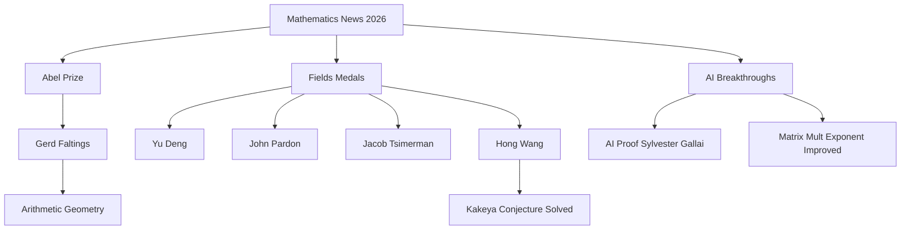

### Mathematics Thrives: A Look at 2026's Landmark Achievements

The year 2026 has been nothing short of extraordinary for the world of mathematics, marked by groundbreaking discoveries, the resolution of long-standing conjectures, and the recognition of brilliant minds. As of September 12, 2026, the mathematical community celebrates significant advancements that promise to shape future research.

**Abel Prize Honors Arithmetic Geometry**
The prestigious Abel Prize for 2026 was awarded to Professor Gerd Faltings for his profound contributions to arithmetic geometry. Faltings was recognized for introducing powerful tools that led to the resolution of the long-standing Diophantine conjectures of Mordell and Lang. This recognition highlights the enduring impact of his work on number theory.

**Fields Medals Celebrate Diverse Excellence**
Four exceptional mathematicians were awarded the Fields Medal in July 2026, acknowledging their outstanding achievements and the promise of future breakthroughs. The recipients are:
*   **Yu Deng**, for his rigorous derivation of the Boltzmann equation from hard-sphere dynamics and work in partial differential equations.
*   **John Pardon**, for his achievements in symplectic geometry and contributions to other areas of geometry and topology.
*   **Jacob Tsimerman**, for recasting o-minimality as a fundamental method in arithmetic and complex algebraic geometry, including his role in proving the Andre-Oort conjecture.
*   **Hong Wang**, for her work in harmonic analysis and geometric measure theory, notably advancing the Kakeya problem in three dimensions. Wang, along with Joshua Zahl, settled the three-dimensional Kakeya conjecture in early 2025.

**AI's Ascendant Role in Discovery**
Artificial intelligence continues its integration into mathematical research, achieving significant milestones. In a historic first, an AI system named LeanMind, a collaboration between the Institute for Advanced Study and DeepMind, discovered a proof of the Sylvester-Gallai conjecture in Euclidean geometry without substantial human guidance. This marks a pivotal moment, demonstrating AI's capacity to generate novel mathematical proofs. Furthermore, the matrix multiplication exponent ω saw an improvement, falling to 2.3719, thanks to the AlphaTensor system's use of tensor decomposition and deep reinforcement learning. The increasing trend of "formalized mathematics," with top journals now requiring formal verification for computationally intensive proofs, underscores AI's growing influence on mathematical rigor and discovery.

Beyond these awards, 2025 saw the monumental proof of the Geometric Langlands Conjecture by a team of nine researchers, a breakthrough hailed as a potential "grand unified theory of mathematics." These developments signal a vibrant and rapidly evolving landscape in the mathematical sciences.

