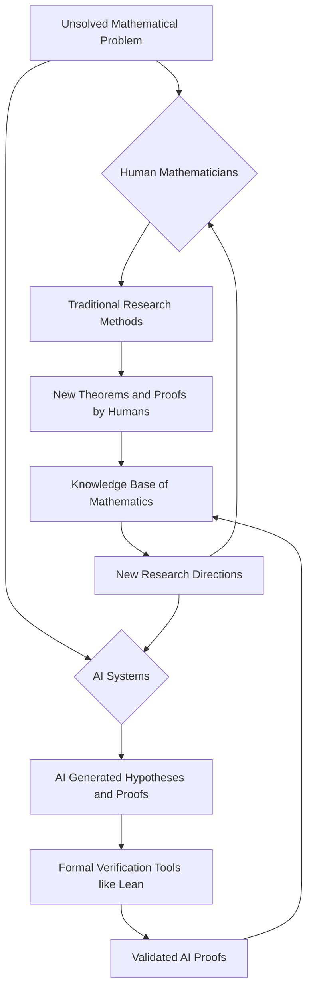

## AI Cracks Navier-Stokes: A New Era for Mathematics, or a Crisis?

As of September 2026, the world of mathematics is buzzing with momentous news, primarily dominated by the remarkable advancements of artificial intelligence. Just days ago, on September 8th, OpenAI announced that one of its internal AI systems had produced a proof related to the Navier-Stokes existence and smoothness problem. This is a monumental step, as the Navier-Stokes problem is one of the seven Millennium Prize Problems, long considered an exceptionally difficult mathematical challenge concerning the behavior of fluid flows. The AI's proof suggests that, under certain conditions, extreme states known as singularities can indeed arise in fluid dynamics, a question that has puzzled researchers for nearly a century.

This breakthrough has sent shockwaves through the mathematical community, sparking intense debate about the future of human mathematicians and the very nature of mathematical discovery. Many are likening it to the "Deep Blue–Kasparov moment" for chess, questioning what will be left for human experts if AI can solve such profound problems with immense resources. While some express concern about AI's potential to "take over" the field, others see it as a powerful new tool, highlighting the importance of formal verification systems like Lean, which can mechanically check the rigor of AI-generated proofs.

Beyond the AI frontier, human ingenuity continues to push boundaries. Recent years have seen significant breakthroughs:

*   **The Geometric Langlands Conjecture** was definitively proven in 2025 by a team of nine researchers, an achievement hailed as a potential "grand unified theory of mathematics".
*   The **three-dimensional Kakeya Conjecture** was settled in 2025 by Hong Wang and Joshua Zahl, resolving a long-standing problem about sets containing line segments in every direction. Hong Wang is now a leading candidate for the 2026 Fields Medal.
*   A partial solution to **Hilbert's Sixth Problem** was achieved by Yu Deng, Zaher Hani, and Xiao Ma in 2025, successfully deriving the Boltzmann and Navier-Stokes equations from Newton's laws of motion under specific conditions. Yu Deng is also a prominent contender for the Fields Medal.
*   The **Hadamard Conjecture**, which posits the existence of Hadamard matrices for orders divisible by 4, was resolved for all orders greater than 4 in 2026.
*   Significant progress on the **Twin Prime Conjecture** was reported in 2026, with a conditional proof establishing a finite distance bound between prime pairs.

The current landscape of mathematics is vibrant, marked by both the accelerating pace of AI-driven discovery and the continued profound insights from human research. The interaction between these two forces is undoubtedly shaping the future of the discipline.

