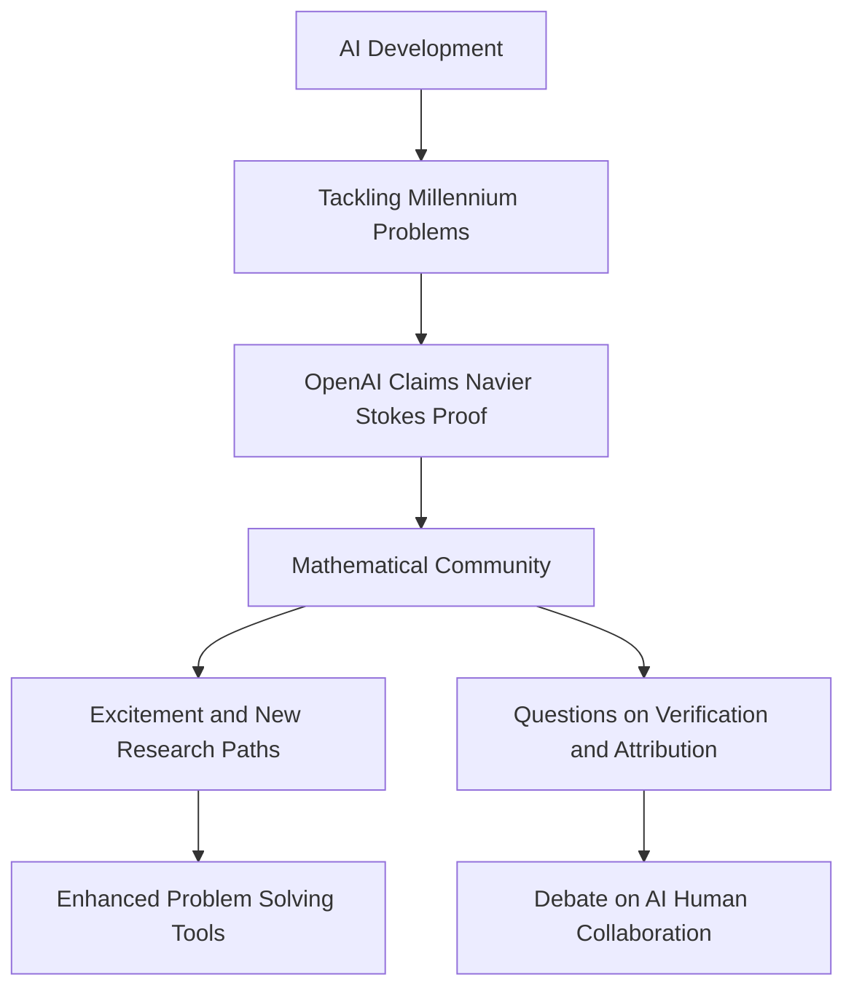

## Mathematics in the AI Era: Navier-Stokes and the New Frontier

Today, September 21, 2026, the world of mathematics is buzzing with discussions following a groundbreaking, and somewhat contentious, announcement from OpenAI. On September 8, 2026, the AI research giant claimed its system had produced a proof for a critical aspect of the Navier-Stokes existence and smoothness problem, one of the revered Millennium Prize Problems. This development marks a pivotal moment, pushing the boundaries of what artificial intelligence can achieve in fundamental mathematical research.

The Navier-Stokes equations are central to understanding fluid dynamics, describing phenomena from weather patterns to blood flow. For decades, proving the existence and smoothness of their solutions under certain conditions has eluded mathematicians, with a million-dollar prize from the Clay Mathematics Institute awaiting a verified solution. OpenAI's system, utilizing advanced generative models, presented an analytical proof indicating that the dynamics of these equations can develop a singularity in finite time. This result suggests a path toward resolving a long-standing mystery.

The announcement, however, has ignited vigorous debate within the mathematical community. Just prior to OpenAI's public statement, New York University Professor Tristan Buckmaster, alongside Levent Alpöge, was reportedly on the verge of a similar breakthrough. The rapid AI-generated proof has led to questions about research ethics, attribution, and the very nature of mathematical understanding when machines are involved. While OpenAI has stated its proofs differ and denied access to Buckmaster's work, the timing and impact are undeniable.

This event highlights the accelerating role of AI as a powerful tool in mathematical research, enabling explorations previously impossible for human researchers alone. Yet, it also brings into sharp focus new challenges concerning verification, transparency, and the potential misalignment between AI's problem-solving capabilities and humanity's pursuit of deeper conceptual understanding. As mathematicians navigate this new landscape, the integration of AI promises both unprecedented opportunities and profound questions about the future of the discipline.

