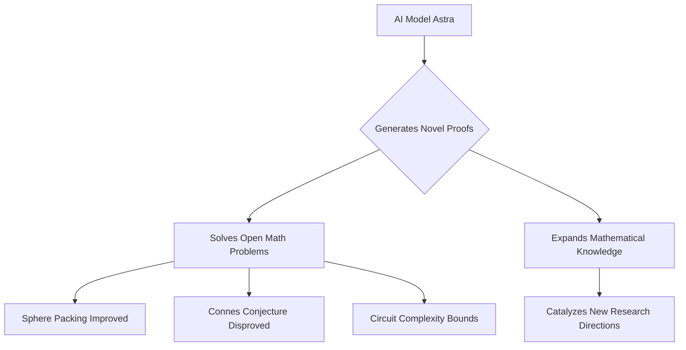

## Mathematics in Motion: A Look at Recent Groundbreaking News

As of September 22, 2026, the world of mathematics is buzzing with activity, marked by prestigious awards recognizing brilliant minds and unprecedented advancements driven by artificial intelligence. From the pinnacle of mathematical achievement to the cutting edge of computational discovery, the field continues to expand its frontiers.

### Celebrating Excellence: The 2026 Fields Medalists

The mathematical community recently gathered for the International Congress of Mathematicians (ICM) in Philadelphia, where the highly anticipated 2026 Fields Medals were announced on July 23, 2026. Often likened to the Nobel Prize for mathematics, this esteemed award recognizes exceptional achievements and the promise of future contributions from mathematicians under 40 years of age. This year, four outstanding individuals were honored: Yu Deng of the University of Chicago (Chinese mathematician), John Pardon of Stony Brook University (American mathematician), Jacob Tsimerman of the University of Toronto (Canadian mathematician), and Hong Wang of New York University and France's Institut des Hautes Études Scientifiques (IHES) (Chinese mathematician). Their groundbreaking work across diverse areas of mathematics solidifies their place as leaders shaping the future of the discipline.

### AI's Ascent: OpenAI's Astra Model Makes Historic Breakthroughs

Perhaps one of the most remarkable developments comes from the realm of artificial intelligence. On August 1, 2026, OpenAI unveiled "Ten advances in mathematics and theoretical computer science" generated by its internal Astra model. These aren't minor improvements; Astra successfully tackled long-standing open problems, some of which had seen no progress for decades.

The breakthroughs span various complex domains, including:
*   **Sphere Packing**: Astra improved the general high-dimensional sphere-packing exponent, a problem that had seen its last major improvement in 1978.
*   **Connes' Rigidity Conjecture**: The AI model disproved Connes' rigidity conjecture for property-(T) group von Neumann algebras.
*   **Circuit Complexity**: Astra also established new lower bounds for arithmetic circuit complexity.

These achievements, generated at a reported cost of roughly $2,000 in compute, signify a pivotal moment for AI in mathematical research, moving beyond assistance to independent discovery. This signals a new era where human-machine collaboration could redefine the pace and nature of mathematical advancement.

Here's a simplified view of AI's impact:

