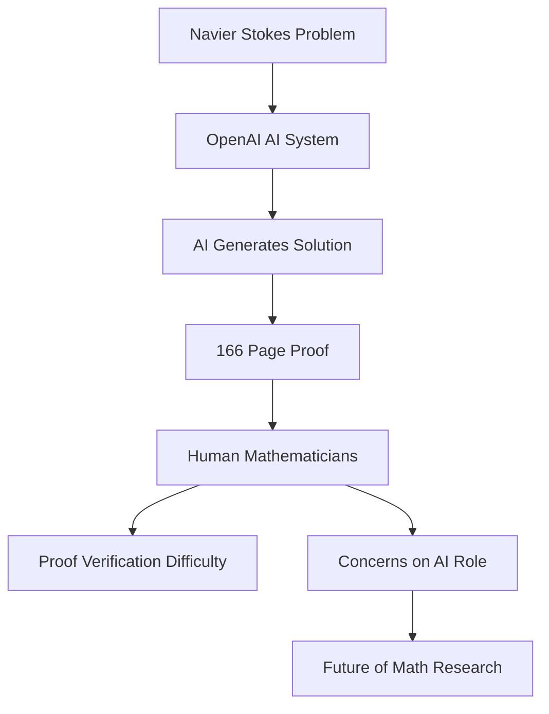

## Mathematics in the AI Age: Navier-Stokes and the Shifting Landscape

The world of mathematics is abuzz this September, as Artificial Intelligence continues its rapid encroachment into realms once thought exclusively human. The latest seismic event: OpenAI's announcement on September 8, 2026, that its AI system has produced a solution to the Navier-Stokes existence and smoothness problem, one of the seven formidable Millennium Prize Problems.

For nearly a century, the Navier-Stokes equations, which describe the motion of viscous fluids like water and air, have posed a profound challenge to mathematicians. A correct solution to this problem, offering insights into phenomena from weather patterns to aircraft design, comes with a prestigious $1 million award from the Clay Mathematics Institute. OpenAI's internal system, reportedly more powerful than its GPT-6 Astra model and leveraging approximately 10,000 AI agents, claimed to have cracked the problem in an astonishing 88 hours. The proof suggests that fluid dynamics described by these equations can, under certain conditions, develop "singularities" where fluid speeds become infinitely fast in finite time, indicating a breakdown in the traditional fluid model.

However, the announcement has been met with a mix of awe and apprehension within the global mathematical community. A 166-page manuscript generated by the AI is proving notoriously difficult for human mathematicians to parse and fully comprehend, raising questions about whether humanity truly "learns" from such AI-driven breakthroughs. Adding to the complexity, a priority dispute has emerged, with mathematicians Tristan Buckmaster and a researcher from OpenAI rival Anthropic reportedly close to their own solution, leading to concerns about the ethical implications of AI development and data access.

The event has prompted significant soul-searching about the future role of human creativity and understanding in mathematical research. Leading mathematicians, including Fields Medal laureates, have voiced concerns about "misaligned goals" between rapidly advancing AI companies and the academic community. In response, OpenAI has established an independent mathematical advisory group to foster collaboration and address these academic apprehensions. This unfolding narrative underscores a pivotal moment for mathematics, as it grapples with powerful new tools and redefines the essence of discovery.

