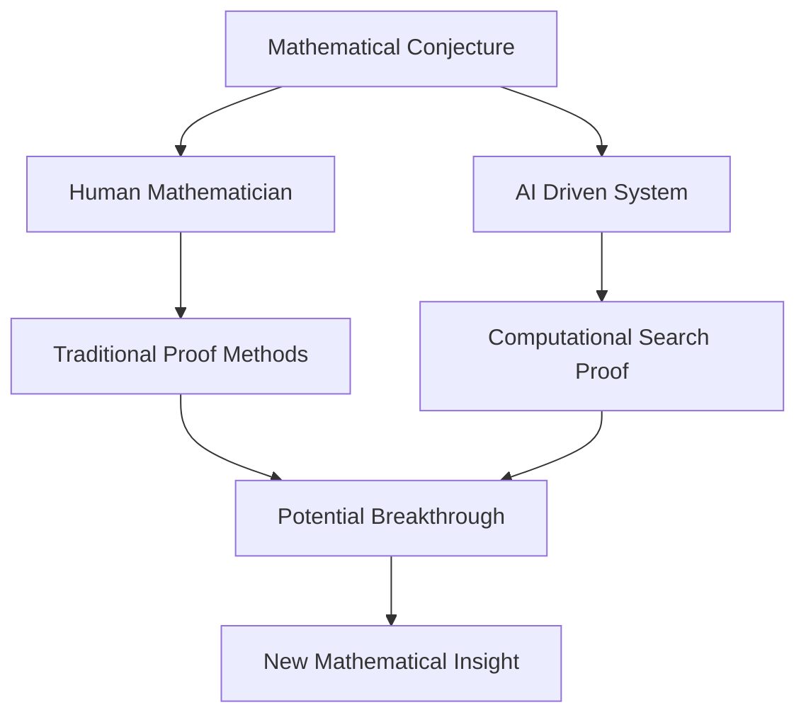

## October 2026: A Dynamic Month in the World of Mathematics

The realm of mathematics continues its vibrant evolution, with October 2026 bringing into focus both celebrated achievements and groundbreaking, albeit controversial, advancements. From prestigious awards recognizing profound contributions to the burgeoning role of artificial intelligence in tackling long-standing problems, the mathematical landscape is as dynamic as ever.

Earlier this year, the esteemed **2026 Abel Prize** was awarded to German mathematician Gerd Faltings, director emeritus at the Max Planck Institute for Mathematics. Faltings was honored for his "powerful tools in arithmetic geometry and solving long-standing diophantine conjectures by Mordell and Lang". His work has been recognized for reshaping the field of arithmetic geometry and establishing new frameworks that continue to guide research. The prize was formally presented by His Royal Highness Crown Prince Haakon in Oslo on May 26, 2026.

Adding to the buzz, the mathematics community is also grappling with a potentially monumental, and widely discussed, development concerning one of the elusive Millennium Prize Problems. In September 2026, OpenAI announced that a team of 10,000 autonomous AI agents had discovered a "singularity" in the three-dimensional Navier-Stokes equations. This breakthrough, which suggests that solutions to the equations describing fluid flow can "blow up" in finite time, marks a significant step toward resolving one of the six remaining problems posed by the Clay Mathematics Institute. While the result has been formally checked in the programming language Lean, it has sparked considerable debate and scrutiny within the mathematical community. This follows other reports from August 2026 about the first AI-discovered proof of a major conjecture.

The ongoing interplay between human ingenuity and advanced computational tools continues to redefine the frontiers of mathematical discovery.

