# Reshaping Cures: How AI is Revolutionizing Drug Discovery

**Date:** May 23, 2024

The quest for new medicines has always been a monumental undertaking – a process famously characterized by high costs, lengthy timelines (often 10-15 years), and an abysmal success rate. Traditional drug discovery methods, reliant on painstaking manual experimentation and iterative refinement, are struggling to keep pace with the accelerating global health challenges. Enter Artificial Intelligence, a disruptive force poised to fundamentally transform how we identify, develop, and deliver life-saving therapeutics.

AI is no longer a futuristic concept but a vital partner in the lab, supercharging every stage of the drug discovery pipeline. From sifting through mountains of genomic data to pinpoint promising disease targets, to designing novel molecules from scratch, AI algorithms can perform tasks that would take human scientists decades. Virtual screening, powered by machine learning, can analyze billions of chemical compounds in a fraction of the time it takes for wet-lab assays, predicting their efficacy, toxicity, and drug-like properties (ADMET) with remarkable accuracy. This dramatically narrows down the pool of candidates, allowing researchers to focus on the most promising leads.

Beyond initial compound identification, AI assists in optimizing lead molecules, predicting synthetic pathways, and even designing more efficient and targeted clinical trials by identifying ideal patient cohorts. While AI won't replace human creativity or the critical need for experimental validation, it acts as an unparalleled accelerant and a powerful idea generator. This integration of AI promises not just to reduce the cost and time of drug development but also to uncover entirely new chemical spaces and therapeutic modalities previously beyond our reach. The era of precision medicine, where treatments are tailored to individual biological profiles, is being brought closer by AI's molecular revolution.

```mermaid
graph TD
    subgraph AI-Accelerated Drug Discovery Pipeline
        A[Phase 0: Disease Target Identification] --> B(AI: Prioritize & Validate Novel Targets)
        B --> C[Phase 1: Molecule Generation & Screening]
        C --> D(AI: Virtual Screening, Efficacy & Toxicity Prediction)
        D --> E[Phase 2: Lead Optimization & Synthesis]
        E --> F(AI: De Novo Design, Property Tuning & Synthetic Route Planning)
        F --> G[Phase 3: Pre-clinical & Clinical Trial Design]
        G --> H(AI: Trial Optimization, Patient Selection & Biomarker Discovery)
        H --> I[Phase 4: Regulatory Submission & Market]

        style A fill:#e0e0e0,stroke:#333
        style C fill:#e0e0e0,stroke:#333
        style E fill:#e0e0e0,stroke:#333
        style G fill:#e0e0e0,stroke:#333
        style I fill:#e0e0e0,stroke:#333

        style B fill:#cceeff,stroke:#0066cc,stroke-width:2px,color:#000
        style D fill:#cceeff,stroke:#0066cc,stroke-width:2px,color:#000
        style F fill:#cceeff,stroke:#0066cc,stroke-width:2px,color:#000
        style H fill:#cceeff,stroke:#0066cc,stroke-width:2px,color:#000
    end
```

