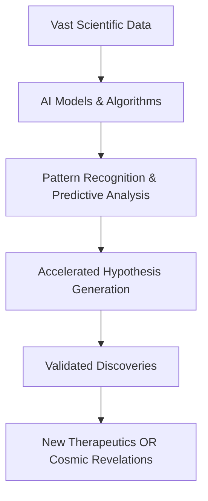

## The AI Imperative: Reshaping Scientific Discovery in May 2026

**May 03, 2026**

The world of science is experiencing a profound transformation, with artificial intelligence (AI) emerging as a central catalyst for groundbreaking discoveries. This week's developments underscore a pivotal shift, where AI is no longer merely a tool but an indispensable partner, accelerating research across diverse fields from the microscopic complexities of genetics to the vast expanse of the cosmos.

One of the most impactful areas witnessing this AI-driven revolution is **precision medicine and drug discovery**. Pharmaceutical giants are increasingly leveraging AI to unlock previously intractable challenges in genetic medicine. Eli Lilly, for instance, has partnered with AI company Profluent to develop AI-designed recombinases – custom enzymes programmed for precise DNA editing. This collaboration aims to achieve kilobase-scale DNA editing, a "holy grail" in genetic medicine, by utilizing AI models to design and optimize site-specific recombinases for multiple genomic targets. This innovative approach promises to expand the scope and scalability of programmable gene editing therapeutics, moving beyond traditional methods that rely on naturally occurring enzymes. The broader biotechnology sector is seeing AI models and predictive platforms unify various data streams, from genomics to clinical studies, creating a "common intelligence layer" that speeds up decision-making and refines predictions throughout the drug development process.

Beyond the lab, AI's analytical prowess is also unveiling the universe's secrets. Astronomers at the University of Warwick recently confirmed over 100 exoplanets, including 31 newly identified worlds, by employing a powerful new AI tool called RAVEN. This system meticulously combed through data from NASA's Transiting Exoplanet Survey Satellite (TESS), analyzing millions of stars to detect subtle dips in starlight indicative of orbiting planets. Such breakthroughs highlight how AI is enhancing our observational capabilities, allowing us to uncover rare and extreme celestial bodies, even those in the mysterious "Neptunian desert". Simultaneously, a decades-old cosmic enigma involving the strange X-rays from the bright star gamma-Cas has been solved thanks to cutting-edge observations and analysis, revealing a hidden white dwarf star siphoning material and producing powerful emissions.

The integration of AI into scientific workflows marks a paradigm shift, enabling researchers to process vast datasets, predict complex interactions, and accelerate the journey from hypothesis to discovery. This synergistic relationship is defining the pace of innovation in 2026 and paving the way for unprecedented scientific advancements.

