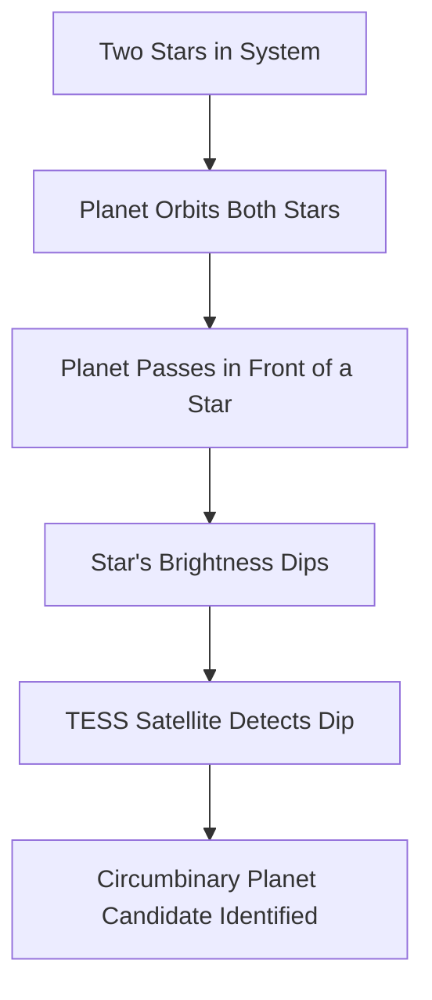

**Catching Double Shadows: Astronomers Uncover Dozens of 'Tatooine-like' Worlds**

May 04, 2026

Science continues to unveil the universe's incredible diversity, and today brings thrilling news for astronomy enthusiasts. On May 4th, astronomers announced the discovery of 27 new potential planets orbiting two stars, significantly expanding our understanding of these exotic "circumbinary" worlds. These discoveries more than double the number of previously identified circumbinary planets, which famously evoke images of Luke Skywalker's home planet, Tatooine.

Until recently, only about 18 circumbinary planets were known, despite more than half of the stars in our galaxy existing in binary or multiple star systems. The challenge lies in their detection. Traditional methods often rely on observing a "transit" – a dip in a star's brightness as a planet passes in front of it. However, this requires a precise alignment with our line of sight, meaning many such systems remain hidden.

Using data from NASA's Transiting Exoplanet Survey Satellite (TESS), researchers employed innovative techniques to identify these new candidates. The identified planets are thought to range in size from Neptune-like to ten times the mass of Jupiter, located between 650 and 18,000 light-years from Earth. This breakthrough highlights the power of advanced observational methods and data analysis in revealing the hidden wonders of the cosmos.

The existence of so many circumbinary planets suggests that planet formation in multi-star systems might be more common and varied than previously assumed. Each new discovery provides crucial data points for refining our models of planetary system evolution.

