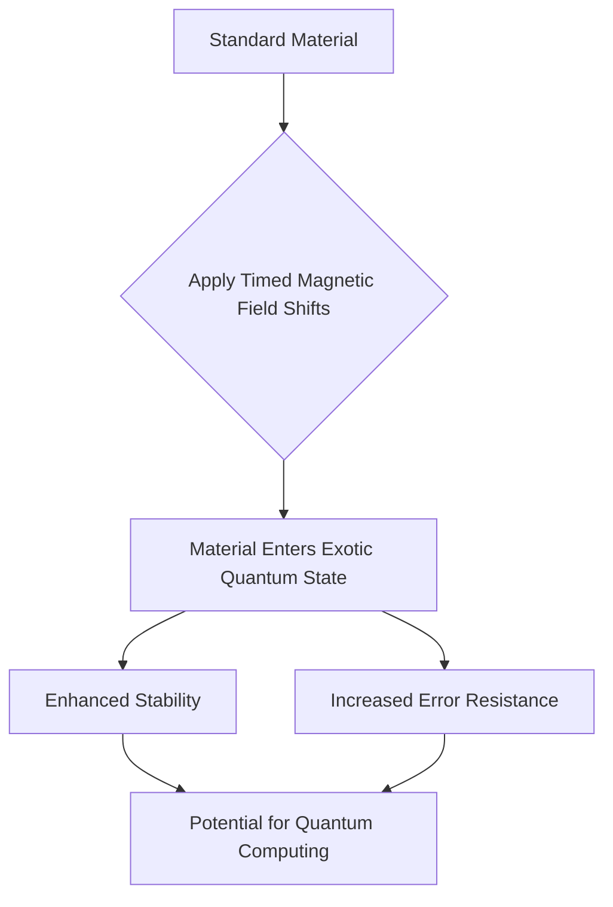

## Unlocking New Realities: Scientists Forge Exotic Forms of Matter for Quantum Future

**May 05, 2026** – In a groundbreaking development that could profoundly impact quantum computing, scientists have successfully created entirely new forms of matter by precisely manipulating magnetic fields over time. This breakthrough, published today, reveals that simply altering a magnetic field can unlock quantum states previously thought impossible under normal conditions.

Researchers achieved these exotic quantum states by carefully "driving" materials with timed magnetic shifts. The resulting matter exhibits enhanced stability and error resistance, addressing a critical challenge in the development of robust quantum computers. This suggests that the future of quantum technology may hinge not just on the composition of materials, but on the dynamic ways they are controlled and manipulated through time. This discovery marks a significant leap in fundamental physics, offering novel pathways for exploring complex quantum phenomena and potentially paving the way for more stable and powerful quantum computing architectures.

