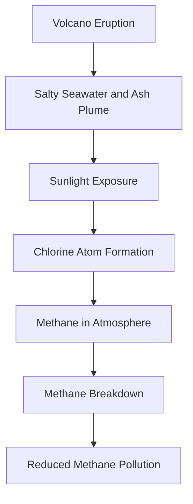

## Science Shocker: Volcanoes Lending a Hand in Climate Cleanup!

May 07, 2026 – In an unexpected turn for climate science, researchers announced today a surprising discovery about the Hunga Tonga-Hunga Ha'apai volcano's massive 2022 eruption. It appears this powerful event didn't just spew ash and gases; it also played a significant role in cleaning up methane pollution from our atmosphere. This revelation could open new avenues for understanding and potentially mitigating global warming.

Scientists observed unusually high concentrations of formaldehyde in the volcanic plume, a key indicator of methane breakdown. The mechanism involves the immense amount of salty seawater hurled into the stratosphere during the eruption. When sunlight hit this mixture of sea salt and volcanic ash, highly reactive chlorine atoms were formed. These chlorine atoms then reacted with and broke down methane, a potent greenhouse gas, in the atmosphere. This natural process effectively cleaned up some of the methane the volcano itself released, highlighting an unforeseen interaction between geological events and atmospheric chemistry.

This discovery suggests that atmospheric dust, like that from volcanic eruptions, impacts the global methane budget, a factor not previously considered in climate models. While reducing carbon dioxide emissions remains crucial for long-term climate stability, understanding natural methane removal processes offers new insights into potential "emergency brakes" for climate change.

