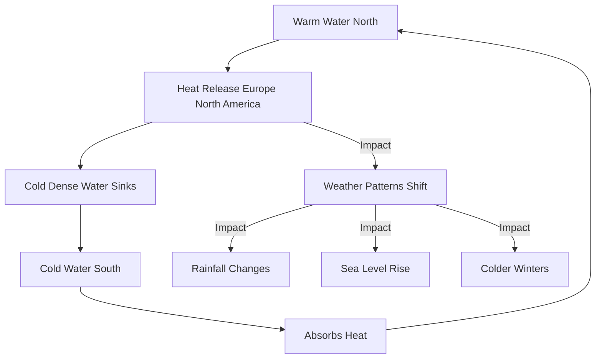

## Breaking Science: Atlantic Ocean Current Showing Signs of Weakening

**May 10, 2026** – New research published today reveals compelling evidence that the Atlantic Meridional Overturning Circulation (AMOC), a crucial system of ocean currents vital for regulating Earth's climate, has been steadily weakening for nearly two decades. This slowdown has been detected across a vast region of the North Atlantic, raising concerns about potential global ramifications.

The AMOC acts like a giant conveyor belt, transporting warm, salty water from the tropics northward and returning colder, denser water southward at deeper levels. This circulation plays a significant role in distributing heat around the globe, influencing weather patterns, rainfall, and sea levels.

Scientists at the University of Miami Rosenstiel School of Marine, Atmospheric, and Earth Science led the study, which provides some of the strongest direct observational evidence to date of the AMOC's diminishing strength. A weaker AMOC could lead to more extreme storms, shifts in rainfall, and colder winters in parts of Europe and North America. It could also influence sea-level rise along coastlines, impacting communities and infrastructure globally.

The findings are critical for improving climate models and better understanding how ongoing climate change may affect the future.

