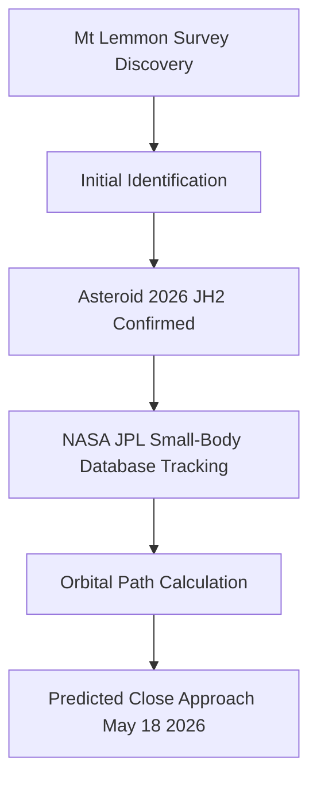

## Asteroid 2026 JH2: A Close Shave for a Basketball-Court Sized Space Rock

As of May 14, 2026, the scientific community is abuzz with the recent discovery and impending close approach of Asteroid 2026 JH2. This newly identified Near-Earth Object (NEO), estimated to be as large as a basketball court, is set to make a relatively close pass by our planet on Monday, May 18, 2026.

First spotted on May 10, 2026, by the Mt. Lemmon Survey in Arizona, USA, Asteroid 2026 JH2 measures between 16 and 35 meters (50-115 feet) wide. Its closest approach to Earth is anticipated at 21:23 UTC on May 18, 2026, when it will pass at a distance of approximately 90,000 kilometers (56,000 miles). To put this into perspective, this means the asteroid will be at just under a quarter of the Earth-Moon distance, though still safely beyond the orbit of geostationary satellites.

Astronomers have reassured the public that there is no danger of 2026 JH2 hitting Earth. The discovery highlights the continuous efforts of observatories worldwide to detect and track NEOs, which are often difficult to spot against the vast darkness of deep space until they are relatively close. Such observations are crucial for understanding our solar system and for planetary defense.

Here's a simplified look at the journey from discovery to predicted close approach:

