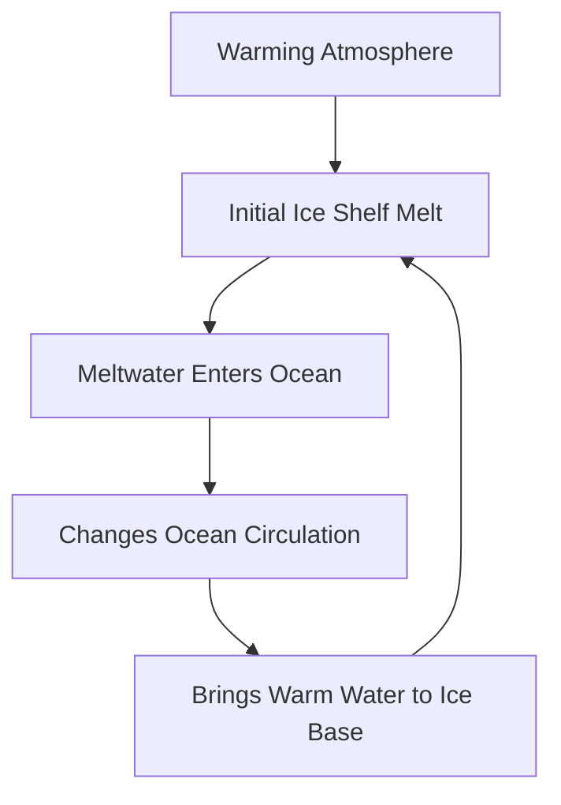

## Antarctic Ice Melt Accelerates: Overlooked Ocean Feedback Loop Revealed

**May 15, 2026** – New research published today reveals a critical, previously underestimated mechanism accelerating Antarctic ice loss, suggesting that current sea-level rise projections might be too conservative. A study led by University of Maryland scientists, appearing in *Nature Geoscience*, highlights a powerful feedback loop where meltwater from ice shelves actively alters ocean circulation, which in turn drives even faster melting.

For years, scientists have warned about the rising sea levels due to melting Antarctic ice. However, most existing global climate models that inform international policy have not fully accounted for the ocean's complex circulatory system's response to this meltwater. The groundbreaking study demonstrates that as freshwater from melting ice shelves enters the ocean, it changes water temperature and density, influencing ocean currents. These altered currents then circulate warmer waters back towards the base of the ice shelves, perpetuating and intensifying the melting process.

This self-reinforcing chain reaction could contribute as much to rising sea levels as the direct effects of a warming atmosphere alone, according to lead author Madeleine Youngs. The findings underscore the urgent need to integrate these dynamic ocean-ice interactions into future climate predictions to gain a more accurate understanding of global sea-level rise and its profound impacts on vulnerable coastal populations worldwide.

