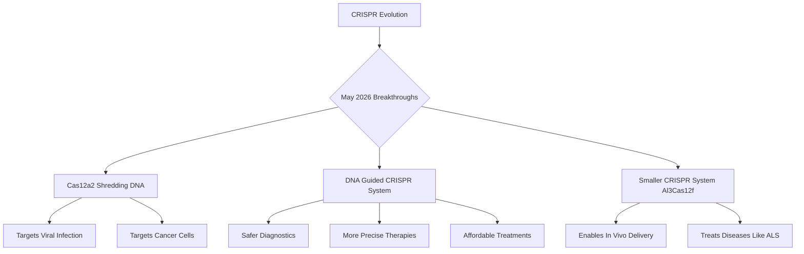

## CRISPR Unleashed: A New Era of Precision in Gene Editing

May 16, 2026 – The landscape of genetic medicine is rapidly evolving, with recent breakthroughs in CRISPR technology promising unprecedented precision and broader therapeutic applications. Scientists are pushing the boundaries of what was once considered science fiction, delivering new tools that could revolutionize how we diagnose and treat a myriad of diseases.

One of the most significant developments is the emergence of a new kind of CRISPR system, Cas12a2. This innovative protein acts like a molecular shredder, capable of destroying the DNA of targeted sick cells while leaving healthy ones untouched. Researchers have successfully programmed Cas12a2 to eliminate virus-infected cells and cancer cells in laboratory settings, opening promising avenues for treating viral infections and malignancies with enhanced specificity and potentially fewer side effects than current therapies.

Further advancing the field, a team at the University of Florida has pioneered the world's first DNA-guided CRISPR system. Traditionally, CRISPR enzymes rely on RNA as a guide to pinpoint their genetic targets. By engineering CRISPR to use DNA, which is inherently more stable and simpler to produce, this breakthrough could lead to diagnostics and treatments that are safer, more precise, and more affordable. This fundamental shift in mechanism has the potential to unlock entirely new strategies for disease control.

Adding to these advancements, an NIH-funded research team has identified and engineered a remarkably small CRISPR enzyme, Al3Cas12f. The reduced size of this system is crucial, as it allows for efficient packaging into adeno-associated virus (AAV) vectors, a leading method for targeted gene therapy delivery inside the human body. This capability addresses a major limitation of earlier, larger CRISPR proteins, which often restricted clinical applications to cells modified outside the body. This paves the way for direct, in vivo gene editing to treat a wider range of diseases, including cancer and ALS.

These concurrent innovations mark a pivotal moment, showcasing CRISPR's expanding versatility and its journey from foundational research to tangible clinical solutions. The future of precision medicine looks brighter than ever, offering new hope for patients worldwide.

