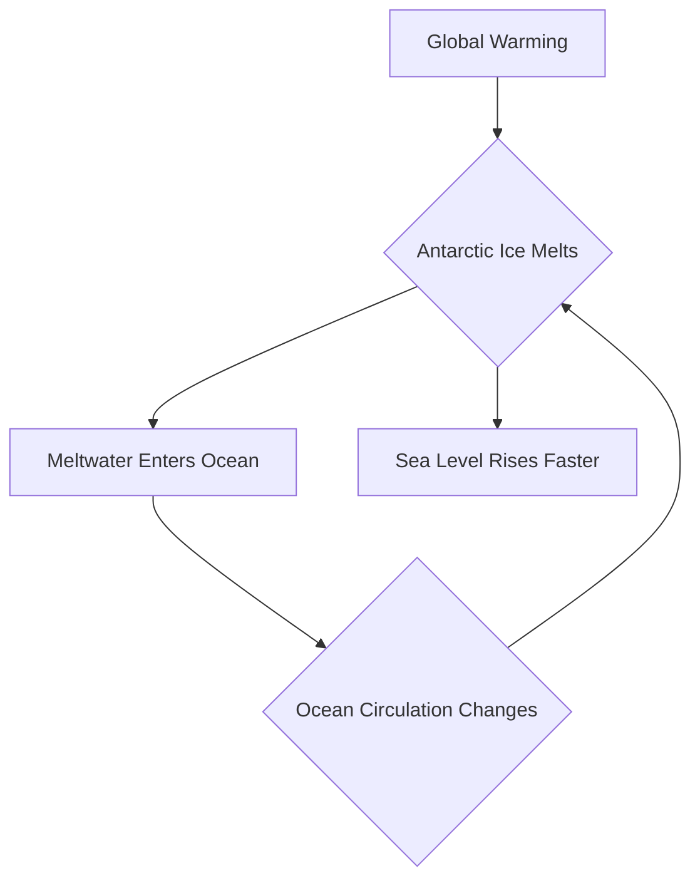

## Science in Motion: Unpacking May 2026's Latest Breakthroughs

As May 2026 unfolds, the scientific community continues to deliver groundbreaking discoveries, pushing the boundaries of our understanding from Earth's poles to the depths of ancient history. Here's a concise look at some of the most impactful news this week.

### Antarctic Ice Loss Accelerates Due to Unaccounted Ocean Feedback

A crucial new study from the University of Maryland reveals that the melting of Antarctic ice shelves isn't just a direct consequence of warming temperatures; it's also creating a dangerous feedback loop within the ocean itself. Published on May 15, 2026, in *Nature Geoscience*, the research highlights that as meltwater flows into the ocean, it alters existing ocean circulation patterns. These altered currents, in turn, drive even faster melting of the ice shelves. This self-reinforcing chain reaction could contribute as much to rising sea levels as the direct effects of a warming atmosphere, a factor largely unconsidered in most current global climate models. This oversight suggests that previous sea-level rise projections may be too conservative, posing an even greater threat to low-lying coastal zones worldwide.

Here's a simplified view of this critical feedback loop:

### Ancient Secrets Unlocked: Organic Molecules Found in Dinosaur Bones

In a stunning revelation that challenges long-held beliefs about fossilization, scientists have uncovered compelling evidence of original proteins within 66-million-year-old dinosaur bones. On May 14, 2026, the University of Liverpool announced findings of collagen, the main protein in bone, in a remarkably well-preserved Edmontosaurus fossil from South Dakota. This discovery, made using advanced techniques like mass spectrometry and protein sequencing, suggests that certain organic materials can survive the fossilization process, opening new avenues for understanding prehistoric life.

### NASA's AI Chip for Autonomous Deep Space Exploration

Looking to the future, NASA is advancing deep space missions with a new, radiation-hardened AI computer chip. Unveiled on May 15, 2026, this next-generation processor is designed to give spacecraft unprecedented autonomy, allowing them to operate more independently far from Earth. With performance levels hundreds of times beyond current spaceflight computers, this technology could enable AI-powered spacecraft, accelerate scientific discoveries, and facilitate smarter missions to the Moon and Mars.