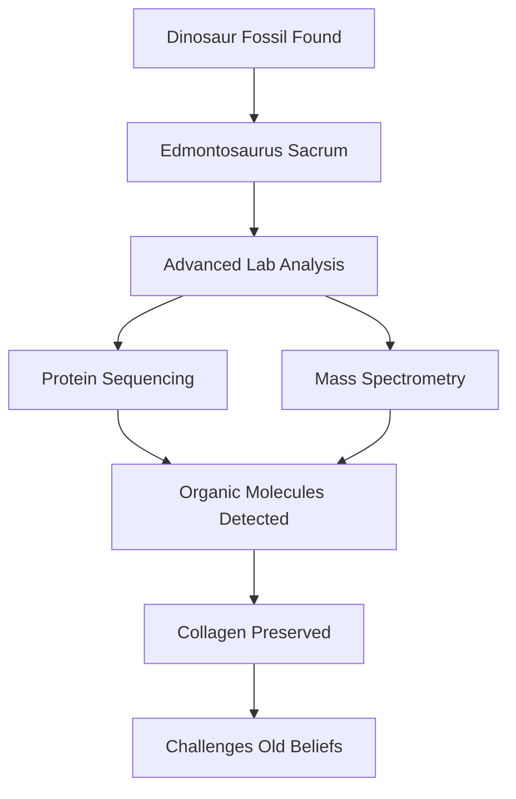

## Science Shakes Up Ancient History: Dinosaur Proteins Discovered, Plus Close Asteroid Flyby!

May 18, 2026 – The world of paleontology is abuzz with a discovery that could fundamentally reshape our understanding of fossilization: scientists have found compelling evidence of original organic molecules, specifically collagen, preserved within 66-million-year-old dinosaur bones. This groundbreaking finding challenges a long-held scientific belief that fossilization completely destroys all organic material, suggesting that ancient biological traces can endure far longer than previously imagined.

Researchers, primarily from the University of Liverpool, examined a remarkably well-preserved *Edmontosaurus* sacrum (part of the hip region) from South Dakota's Hell Creek Formation. Using advanced laboratory techniques, including protein sequencing and various forms of mass spectrometry, they detected remnants of collagen embedded within the fossilized bone. This duck-billed plant-eater lived alongside *Tyrannosaurus rex* near the end of the Cretaceous Period. The discovery supports a controversial idea that has been debated by paleontologists for over three decades, potentially opening new avenues for studying ancient life at a molecular level.

In other breaking news, asteroid 2026 JH2 is making an unusually close flyby of Earth today, May 18, 2026. Discovered on May 10 by astronomers at the Mount Lemmon Observatory, this "blue-whale-size" space rock, estimated to be up to 115 feet wide, will pass closer than some satellites, though there is no danger of impact. Stargazers have the opportunity to view this rare event via livestream.

Meanwhile, in space exploration, SpaceX is gearing up for the highly anticipated Flight 12 test launch of its Starship V3 megarocket on Wednesday, May 20. This mission is crucial, as NASA is relying on Starship to serve as the lunar lander for its Artemis 4 astronauts in 2028. Just last Friday, May 15, NASA and SpaceX successfully launched a Dragon mission, delivering 6,500 pounds of science and supplies to the International Space Station.

From the microscopic world of ancient proteins to the vastness of space, science continues to unveil astonishing new insights into our universe and beyond.