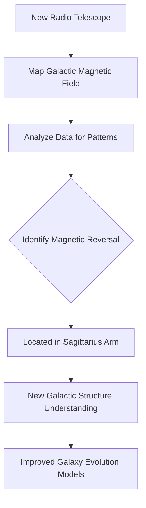

## Galactic Mystery Unraveled: Giant Magnetic Twist Discovered in Milky Way

**May 20, 2026** – Astronomers have announced a groundbreaking discovery, mapping the Milky Way's magnetic field in unprecedented detail and uncovering a massive, unexpected magnetic "twist" hidden within our galaxy. This finding, revealed today, could significantly reshape our understanding of how the Milky Way is structured and how it will evolve in the future.

Using a new radio telescope, researchers were able to create one of the clearest views yet of the galaxy's invisible magnetic field. They discovered a mysterious magnetic reversal, or "flip," cutting diagonally across space in the Sagittarius Arm. This invisible force is crucial, as without a magnetic field, the galaxy would collapse under its own gravity. The detailed mapping and the identification of this diagonal magnetic reversal are poised to provide astronomers worldwide with a major new dataset, enabling the creation of more accurate models for the galaxy's magnetic field over time. This unexpected twist highlights the complexity of our cosmic home and opens new avenues for exploring the fundamental forces that govern galaxies.

