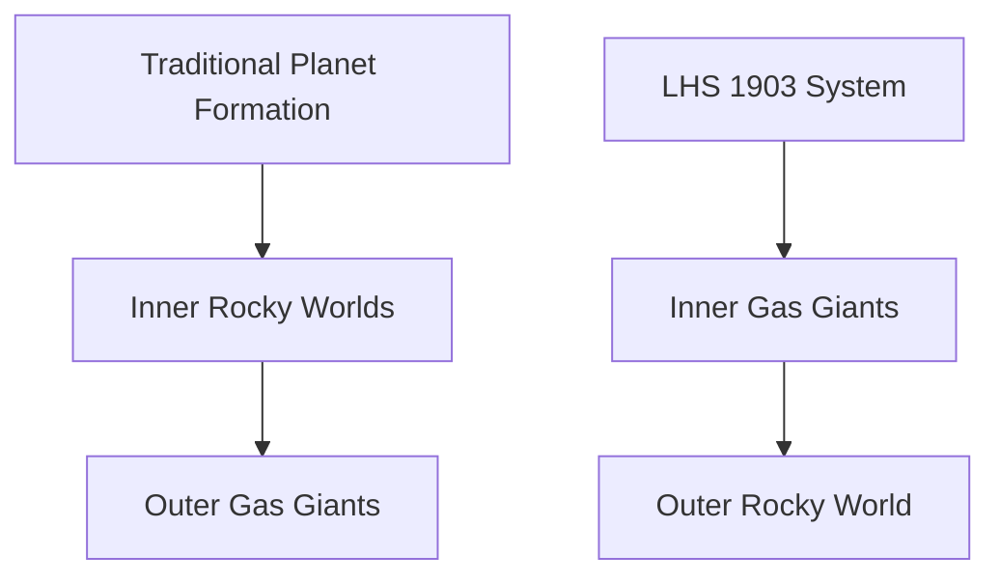

## Science Unveils Cosmic Surprises and Ocean Wonders This May

The world of science continues its relentless march forward, with May 2026 bringing a wave of discoveries that challenge established theories and reveal the hidden biodiversity of our planet. From distant star systems to the deep trenches of our own oceans, researchers are pushing the boundaries of what we know.

One of the most astounding revelations comes from the cosmos, where scientists have detected a bizarre "inside-out" planetary system named LHS 1903. This system defies long-standing theories of planet formation, as a rocky world orbits farther out than its gas giant counterparts. Traditionally, rocky planets are expected to form closer to their star, with gas giants developing further away where cooler conditions allow thick atmospheres to accumulate. The discovery of LHS 1903 hints that planet formation might be far more complex and varied than previously imagined, suggesting that our own Solar System may not be as typical as once thought.

Closer to home, a monumental effort in marine biology has led to the discovery of over 1,100 new marine species in just one year, marking a significant stride in documenting ocean life. The Nippon Foundation-Nekton Ocean Census has uncovered a complex array of life beneath the ocean surface, including a "Ghost Shark" Chimaera in the Coral Sea and symbiotic worms residing within "glass castles" on volcanic seamounts in Japan. These findings highlight the vast, unexplored biodiversity that still thrives in our planet's oceans, underscoring the urgent need for continued exploration and conservation.

Meanwhile, on Jupiter, NASA's Juno spacecraft has provided data suggesting that the gas giant's lightning could be up to 100 times more powerful than lightning on Earth. These colossal storms reveal that Jupiter's atmosphere operates under dramatically different dynamics than our own, with immense energy building before erupting in violent flashes.

The constant stream of new data, whether from distant exoplanets or our own deep seas, reminds us that the universe and our planet hold endless mysteries, continuously reshaped by the relentless pursuit of scientific understanding.

