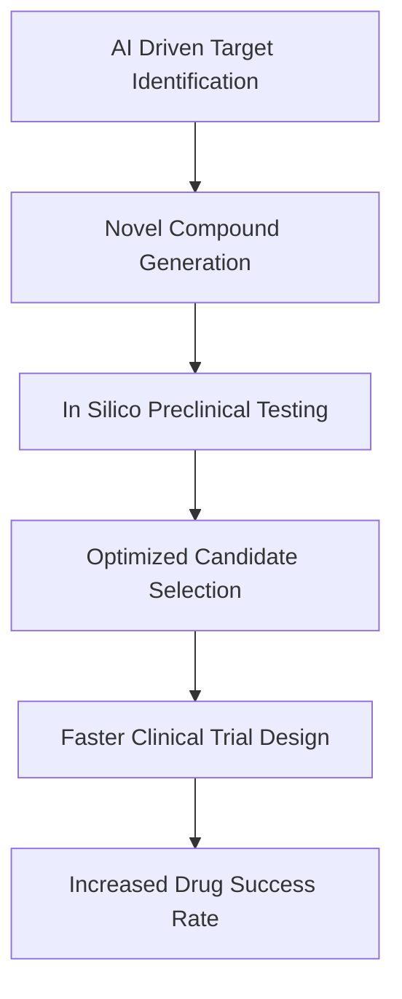

## Science Update: New CRISPR Tech, AI Drug Breakthroughs, and Lunar Ventures Mark a Dynamic May 2026

As May 2026 draws to a close, the world of science continues to push boundaries at an incredible pace, delivering groundbreaking news across biomedicine, artificial intelligence, and space exploration. Researchers are unveiling innovative approaches to treating intractable diseases, while AI is fundamentally reshaping how new medicines are discovered.

One of the most significant developments comes from the realm of gene editing, where a novel CRISPR technology, Cas12a2, has demonstrated the ability to selectively destroy sick cells' DNA, leaving healthy cells unharmed. This "paper shredder" approach holds immense potential for treating viral infections and various cancers, moving beyond traditional gene editing to targeted cell elimination. The US Food and Drug Administration (FDA) is also exploring new regulatory frameworks, like the "plausible mechanism pathway," to drastically accelerate the development and approval of personalized CRISPR-Cas gene-editing therapies for rare genetic diseases, potentially reducing treatment timelines and costs for patients.

Meanwhile, Artificial Intelligence (AI) is solidifying its role as an indispensable tool in drug discovery. The industry is moving beyond pilot programs to industrial-scale AI applications, with companies integrating AI into core research and development processes. This shift is already yielding remarkable results, significantly improving early-stage trial success rates and compressing drug discovery timelines. For instance, an AI-designed drug for idiopathic pulmonary fibrosis completed Phase IIa trials, showcasing an end-to-end AI discovery process that cost approximately $6 million and took around 18 months—a dramatic reduction from the traditional $100–200 million and 6–8 years.

Beyond these biomedical marvels, space exploration continues to captivate. April 2026 saw the successful launch and return of the Artemis II mission, sending astronauts around the Moon for the first time since 1972 and paving the way for future lunar landings. Looking ahead, China's Chang'e 7 mission is set to launch in August 2026 to explore the Moon's south pole for water ice, and Japan's Martian Moons eXploration (MMX) mission in November 2026 aims to land on Mars' moon Phobos and return a sample to Earth. Even the mysteries of the cosmos are being unraveled, with scientists recently identifying blazars—supermassive black holes blasting jets of matter towards Earth—as the possible source of the most energetic neutrino ever detected.

Here's a simplified view of AI's accelerating impact on drug development:

