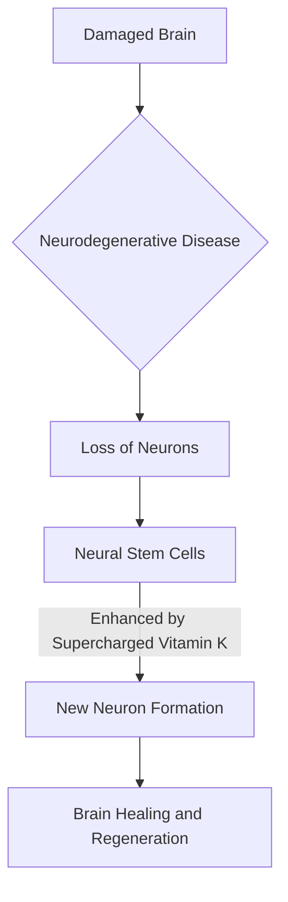

## Science in the News: A Glimpse at May 2026's Cutting Edge

As May 2026 draws to a close, the world of science continues to push boundaries, offering exciting breakthroughs that promise to reshape our understanding of life and the cosmos. From potential cures for debilitating diseases to vast new discoveries in our oceans, this month has been rich with scientific advancement.

One of the most compelling recent developments comes from Japan, where scientists have engineered "supercharged" vitamin K compounds designed to aid the brain in regenerating lost neurons. Published today, May 27, 2026, this research offers a new beacon of hope for individuals suffering from neurodegenerative conditions like Alzheimer's and Parkinson's diseases. By combining vitamin K with elements related to vitamin A, the researchers created compounds that proved three times more effective at transforming neural stem cells into functioning neurons compared to natural vitamin K alone. This innovative approach aims to restore damaged brain tissue, a significant step beyond current treatments that primarily focus on symptom management or slowing decline.

Meanwhile, the deep mysteries of our planet's oceans are being unveiled at an astonishing pace. The Ocean Census project announced earlier this month, around May 19-20, that an astounding 1,121 new marine species were discovered in just a single year. These findings highlight the immense biodiversity still hidden beneath the waves and underscore the ongoing efforts to document and protect marine life.

The intersection of technology and biology also saw a significant spotlight this month. On May 27, a Stanford conference highlighted the transformative role of Artificial Intelligence in scientific discovery, showcasing how AI is enabling researchers to analyze vast datasets and uncover complex patterns across disciplines, from neuroscience to cosmology. This new era of AI-driven research is accelerating the pace of breakthroughs, promising even more rapid advancements in the future.

Here's a look at the potential pathway for neuronal regeneration:

