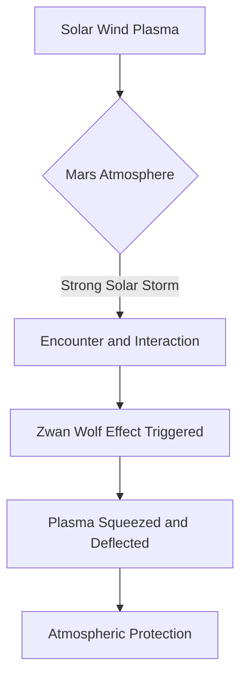

## Martian Atmosphere Reveals Unexpected Solar Wind Shield

**May 28, 2026** – In a significant discovery published today, data from NASA's Mars Atmosphere and Volatile Evolution (MAVEN) spacecraft has provided the first evidence that a phenomenon known as the Zwan-Wolf effect can protect planets from solar winds, even in atmospheres lacking strong magnetic fields. This groundbreaking finding, led by West Virginia University planetary scientist Christopher Fowler, advances our understanding of how our sun interacts with unmagnetized celestial bodies like Mars, Venus, and comets.

Previously, scientists believed the Zwan-Wolf effect, which describes how solar wind plasma is squeezed and deflected around a planet, primarily occurred within a planet's magnetosphere, the region above its atmosphere where a strong magnetic field dominates. However, Fowler and his team observed indications of this effect directly within Mars' atmosphere, specifically during a powerful solar storm in 2023.

The intense solar storm amplified the usually subtle Zwan-Wolf effect, making it detectable by MAVEN's instruments. This suggests that the effect might be a constant, albeit generally weak, protective mechanism for Mars, becoming more pronounced during periods of extreme solar activity. This discovery sheds new light on the complex interplay between the sun and planets, particularly those that, unlike Earth, do not possess a global magnetic field to shield them from the continuous barrage of solar wind.

Understanding this atmospheric protection mechanism is crucial for comprehending planetary evolution and the potential for habitability on worlds beyond Earth.

