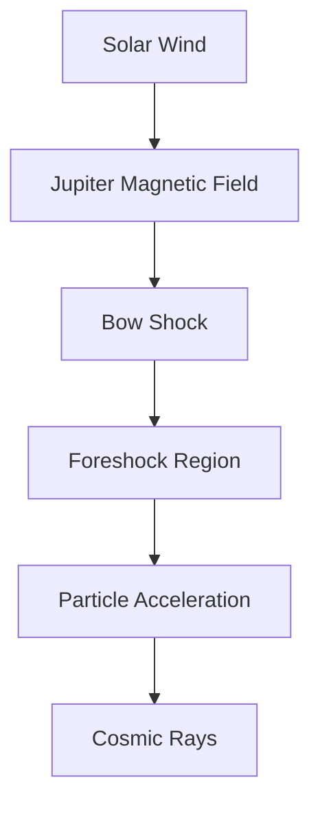

## Juno Unravels Cosmic Ray Mystery Near Jupiter

**June 3, 2026** – NASA's Juno mission, renowned for its deep dives into Jupiter's atmosphere, has just unveiled a significant clue in the century-old mystery of cosmic ray origins. New observations from the gas giant are providing direct evidence for how these high-energy particles are accelerated to near light-speed, a process that could explain the most powerful cosmic rays throughout the universe.

For years, scientists have understood that high-energy particles, including cosmic rays, originate from various sources like supernovae and solar eruptions. However, the precise mechanisms of their acceleration have remained elusive. Now, Juno has captured high-speed electrons in Jupiter's foreshock region – an area where the planet's magnetic field interacts with the stream of solar particles.

The findings, published recently, show that electrons in Jupiter's foreshock are accelerated to even higher speeds than those observed at Earth's foreshock, scaling with Jupiter's larger bow shock. Crucially, this scaling relationship matches what is observed with cosmic rays emanating from supernovae across the galaxy, suggesting that the same fundamental acceleration process occurring within our solar system can also power the most energetic particles in the cosmos. This breakthrough reinforces the idea that planetary bow shocks, and indeed larger astrophysical environments, act as natural particle accelerators.

