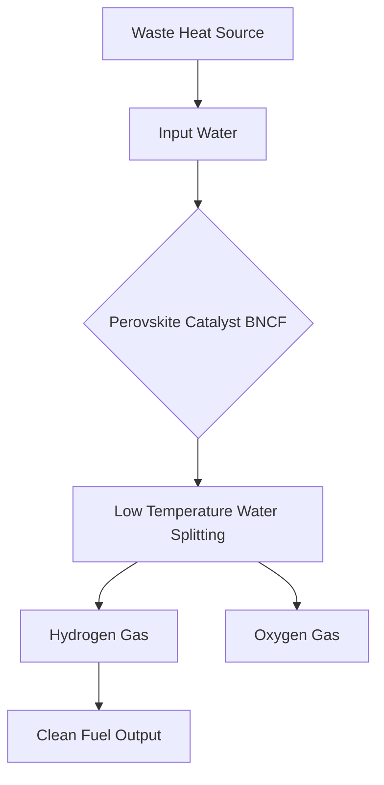

### Green Hydrogen Revolution: Turning Waste Heat into Clean Fuel

**June 7, 2026** – The quest for sustainable energy has taken a significant leap forward with a new breakthrough that promises to make clean hydrogen fuel far cheaper and easier to produce. Researchers at the University of Birmingham have unveiled a novel method for hydrogen production, utilizing a perovskite-based catalyst to split water at remarkably lower temperatures.

Traditionally, thermochemical water splitting, a promising route for hydrogen generation, has been energy-intensive, requiring temperatures between 700-1000 degrees Celsius for water splitting and even higher, 1300-1500 degrees Celsius, for catalyst regeneration. This new research dramatically lowers these temperature requirements, presenting a viable path to convert industrial waste heat into valuable hydrogen.

The Birmingham team's innovation lies in their development of a specific group of BNCF perovskites (composed of barium, niobium, calcium, and iron) that can absorb oxygen at much lower temperatures than previously thought. This allows for the efficient splitting of water into hydrogen and oxygen without the need for extremely high heat inputs.

This breakthrough has profound implications. Factories, steel plants, cement works, and even renewable energy sites, which often generate substantial waste heat, could now become mini-hydrogen production hubs. By harnessing this otherwise lost energy, the cost and environmental footprint of hydrogen production could be drastically reduced, accelerating the transition to a cleaner energy future.

