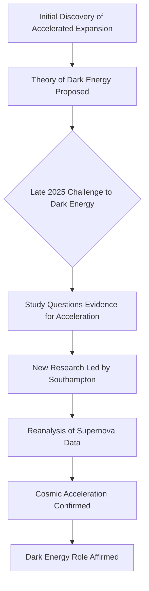

## Cosmic Expansion Confirmed: Dark Energy Prevails Against Recent Doubts

**June 13, 2026** – Today marks a significant reaffirmation in the realm of cosmology, as new research definitively confirms the universe is still expanding at an accelerating rate. This finding resolves a recent debate that had cast a shadow of doubt on one of modern cosmology's most crucial discoveries: the existence of dark energy.

Late in 2025, a study emerged suggesting that the evidence supporting dark energy, the mysterious force believed to drive the universe's ever-faster expansion, was weakening. This analysis proposed the possibility that the universe's expansion might no longer be accelerating, challenging a cornerstone of our understanding of the cosmos.

However, a new investigation led by the University of Southampton has re-examined the data, particularly focusing on supernova observations traditionally used to measure cosmic expansion. The team concluded that the previous study contained key errors in its analysis. After revisiting the evidence, astronomers, including Nobel Prize-winning astrophysicists Professor Adam Riess and Professor Brian Schmidt, have affirmed that cosmic acceleration remains as strong as ever.

This resolution means the universe continues to behave precisely as current cosmological models predict, preserving dark energy's role as a fundamental component of the cosmos.

