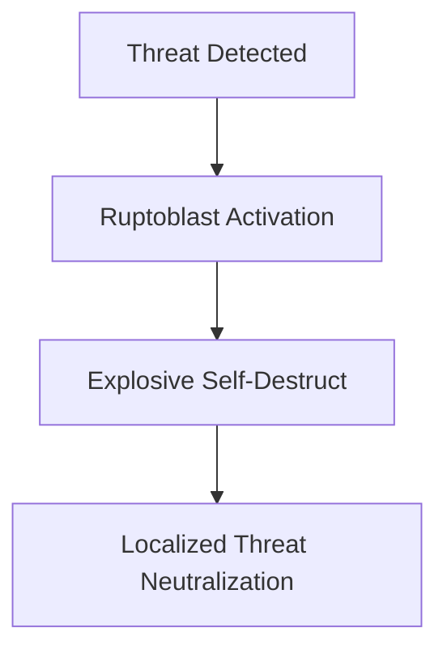

## Science Unveils Explosive Immune Cells and Cosmic Alternatives

June 14, 2026 – The world of science continues its relentless march forward, bringing forth discoveries that challenge our understanding of life and the universe. This week, we're buzzing with news of a novel immune cell with an explosive defense mechanism and a groundbreaking theory proposing an alternative to black holes.

In a remarkable biological discovery, Stanford researchers have identified a new type of immune cell, dubbed "ruptoblasts," in planarian flatworms. These cells possess a unique and violent self-destruct sequence, detonating themselves to destroy nearby threats like bacteria and other cells, then vanishing without a trace within seconds. This localized yet potent defense mechanism, detailed in a study published on June 2, 2026, could open new avenues for developing treatments against bacterial infections and tumors. The findings highlight the unexpected biological strategies that even simple organisms can reveal, offering fresh perspectives on complex medical challenges.

Meanwhile, theoretical physicists are rethinking the ultimate fate of massive stars. A new study, published on June 14, 2026, suggests that a collapsing star might not always form a black hole with a singularity and event horizon. Instead, it could trigger the birth of a miniature universe within the dying star itself, leading to the creation of an exotic object known as a "gravastar." This mini-universe, driven by dark energy, would expand and push back against gravity, preventing complete collapse. This radical theory offers a dynamic solution to Albert Einstein's equations of General Relativity and presents a fascinating alternative to some of the profound questions surrounding black holes.

These recent breakthroughs underscore the incredible diversity and complexity of scientific inquiry, from the microscopic battlegrounds within a flatworm to the cosmic mysteries of stellar death.

