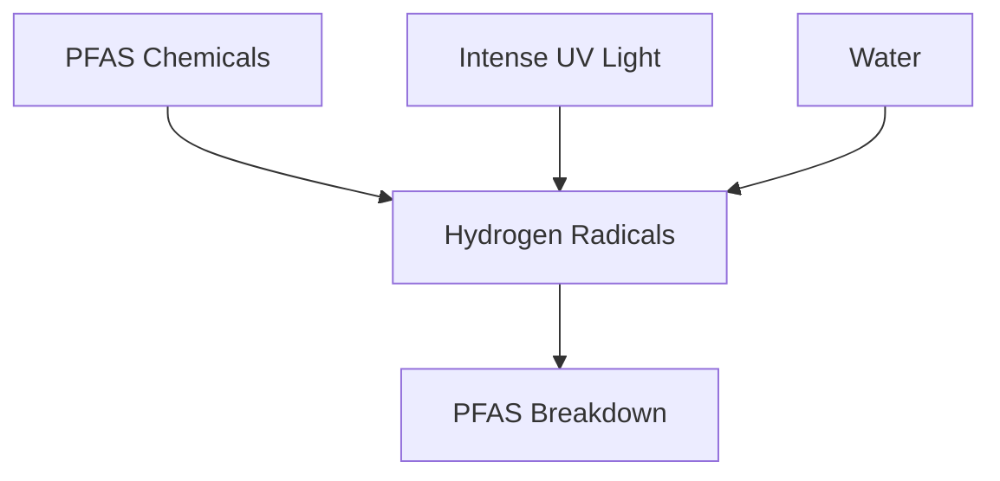

## Cracking the "Forever Chemical" Code: Scientists Find a Hidden Weakness in PFAS

**June 16, 2026** – In a significant environmental breakthrough, scientists have pinpointed a hidden vulnerability in per- and polyfluoroalkyl substances (PFAS), widely known as "forever chemicals." These remarkably stable compounds have long posed a global environmental and public health challenge due to their persistence in water, ecosystems, and even the human body. Now, researchers have discovered a mechanism that could lead to their permanent destruction.

A new study reveals that hydrogen radicals, highly reactive particles generated from water when exposed to intense ultraviolet (UV) light, can effectively break down stubborn PFAS molecules without the need for additional chemicals. This finding challenges previous assumptions about how PFAS degradation occurs and provides a clearer understanding of the underlying chemistry. This breakthrough opens the door to developing greener and more efficient technologies to permanently eliminate these pervasive pollutants, rather than simply moving them from one location to another.

