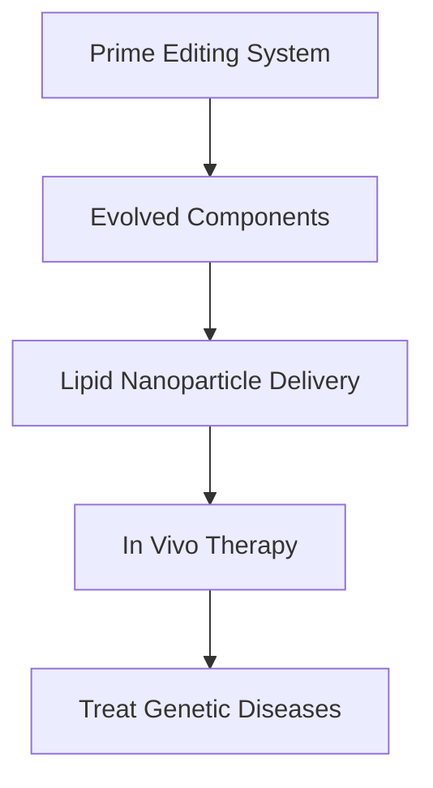

### Science in Focus: Gene Editing Breakthroughs Reshape Therapeutic Horizons

**June 18, 2026** – The world of scientific discovery continues its relentless pace, with major advancements in gene editing technologies promising to revolutionize how we approach disease treatment. Today, exciting news emerges regarding significant improvements in prime editing, pushing us closer to in-body therapies for a vast array of genetic conditions.

Scientists have announced substantial enhancements to prime editing systems, a sophisticated gene-editing tool capable of correcting a wide range of disease-causing mutations. These latest breakthroughs focus on refining nearly every aspect of the technology, notably boosting editing efficiency and optimizing delivery mechanisms. A key advancement involves the improved packaging of editing components within lipid nanoparticles, enabling more effective delivery to target tissues, such as the liver. This development is crucial for transitioning prime editing from laboratory settings to *in vivo* (in-body) therapeutic applications, a long-sought goal for genetic disease treatments. Previously, applying prime editing directly within the body faced significant bottlenecks, but these recent innovations are addressing those challenges head-on.

Prime editing, first developed in 2019, holds the potential to repair the majority of known disease-causing human mutations. While earlier clinical applications have involved *ex vivo* strategies (editing cells outside the body before re-transplanting them), these new improvements bring us closer to directly editing tissues like the liver, lungs, and muscle within a living person. This accelerated progress marks a pivotal moment for genomic medicine, offering new hope for conditions once considered untreatable.

In other significant news surfacing today, researchers have published a comprehensive study mapping the genetic blueprint of NT-proBNP, a crucial heart hormone. This landmark research identified 12 genomic regions linked to NT-proBNP levels, with nine being entirely new discoveries. This deeper understanding of the hormone's genetic factors could reshape our approach to cardiovascular disease, suggesting that NT-proBNP levels are not just markers of heart stress but are actively influenced by pathways that contribute to heart disease.

These concurrent advancements highlight a vibrant era in science, where precision tools and genomic insights are converging to unlock unprecedented therapeutic possibilities.

